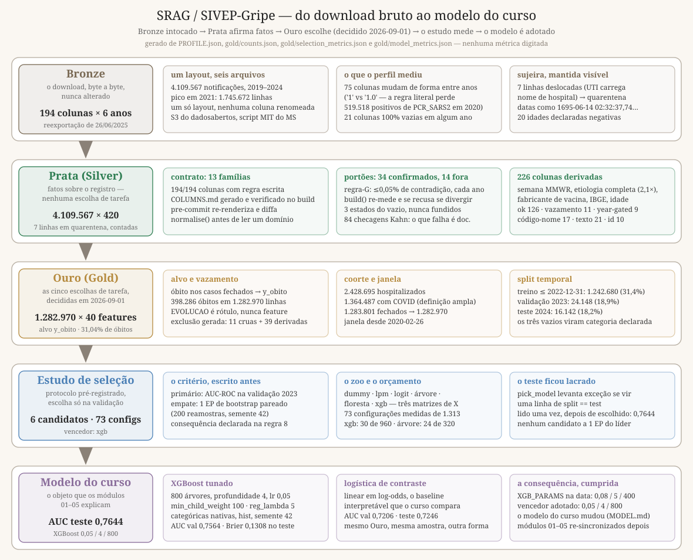
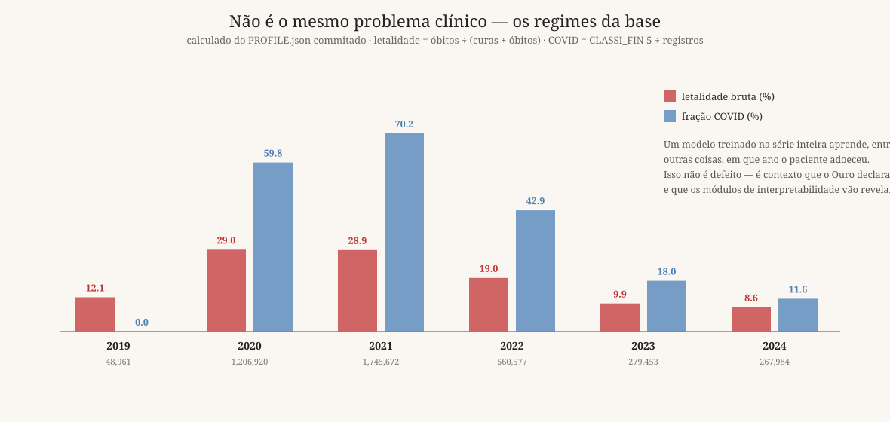
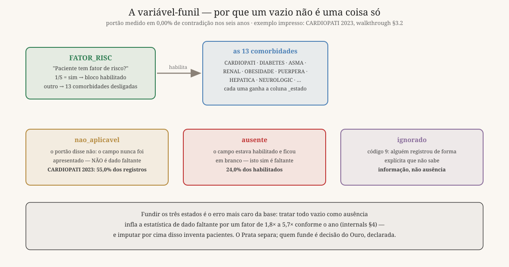

# Módulo 00 — da notificação bruta ao modelo do curso

**4.109.567 notificações** de Síndrome Respiratória Aguda Grave, **194 colunas**, **2019–2024**:
os microdados públicos do Ministério da Saúde sobre os quais o curso é construído. Este módulo é
o percurso inteiro de um trabalho de dados profissional — do arquivo baixado ao modelo escolhido
por protocolo — com a decisão de cada etapa e o preço que o caminho de fábrica teria cobrado. Ele
entrega aos módulos de método um **Prata** (4.109.567 × 420, fatos sobre o registro, sem escolha
de tarefa), um **Ouro** (1.282.970 internações, 40 features, alvo `y_obito`, split temporal), um
**modelo do curso** escolhido por estudo pré-registrado com uma logística de contraste ao lado, e
**um paciente por regra** — o mesmo `gold_id` em todos os módulos, por código, não por disciplina
([`ROADMAP.md`](../../ROADMAP.md)).

A regra de ouro vale dobrado aqui: **todo número em prosa é impresso por célula commitada ou por
documento gerado deste módulo**. Os ponteiros aparecem como `(internals do Prata §4)` — o número
da seção como está no caderno. Quando uma medição contradisse o texto, o texto mudou e o valor
antigo ficou no registro, marcado como corrigido; este módulo carrega várias dessas correções.

## O percurso, em uma tabela

| # | Etapa | O que se decidiu | Default de mercado | Evidência |
|--:|---|---|---|---|
| 1 | Aquisição | seis parquets do banco de 26/06/2025, via S3 | `read_csv` + `concat` | [`srag_fetch.sh`](../../tools/srag_fetch.sh) |
| 2 | Perfilamento | medir cada ano separado, sem normalizar | `describe()` num ano | [`PROFILE.md`](PROFILE.md) · internals do Prata §2 |
| 3 | Regimes | manter a série inteira, declarar o regime | recortar o ano "bom" | internals do Prata §1 e §6 |
| 4 | Forma | normalizar antes de ler qualquer domínio | comparar com `== '1'` | walkthrough do Prata §2 |
| 5 | Vazio | três estados, nunca fundidos | `isna()` + imputação | walkthrough do Prata §3 · internals §4 |
| 6 | Derivadas | 226 colunas com definição e proveniência | derivar o óbvio | [`COLUMNS.md`](COLUMNS.md) · walkthrough do Prata §6 |
| 7 | Contrato | 194/194 com regra; sujeira visível | dicionário em planilha | [`COLUMNS.md`](COLUMNS.md) · walkthrough do Prata §7 |
| 8 | Auditoria | 84 checagens Kahn + reprodução da Fiocruz | lista de asserções | [`QUALITY.md`](QUALITY.md) · [validação](notebooks/srag_infogripe_validation.ipynb) |
| 9 | A virada | o Prata afirma; o Ouro escolhe | `prep.py` com tudo junto | [`GOLD.md`](GOLD.md) |
| 10 | Tarefa | cinco decisões datadas, cada uma flag obrigatória | defaults implícitos | [`gold/MANIFEST.md`](gold/MANIFEST.md) |
| 11 | Seleção | protocolo pré-registrado; teste lido uma vez | `GridSearchCV(cv=5)` | [`SELECTION.md`](SELECTION.md) · cadernos da seleção |
| 12 | Modelo | XGBoost tunado + logística de contraste | model registry | [`MODEL.md`](MODEL.md) · cadernos do modelo |

## O mapa — Bronze, Prata, Ouro



A arquitetura é o **medalhão** (Databricks) dentro do ciclo do **CRISP-DM**, com uma regra que
decide onde cada coisa mora:

| Camada | O que é | O teste |
|---|---|---|
| **Bronze** | o download, byte a byte, nunca alterado | "é o que foi publicado?" |
| **Prata** | fatos sobre o registro: tipos, domínios, estados do vazio, derivadas | "esse valor é determinado pelo registro sozinho?" |
| **Ouro** | escolhas de tarefa: alvo, coorte, exclusões, split | "esse valor depende do que queremos prever?" |

`idade_anos` e `covid_caso` são determinados pelo registro → Prata; `y_obito` e a lista de
exclusão dependem da tarefa → Ouro. As caixas do Ouro estão **tracejadas** no diagrama porque ele
foi desenhado enquanto as decisões estavam abertas. Não estão mais: as cinco foram tomadas em
**2026-09-01**, com dono e data nos blocos "Decidido" do [`GOLD.md`](GOLD.md) e aplicadas no
[`gold/MANIFEST.md`](gold/MANIFEST.md).

### 1. Aquisição — o banco congelado, direto do bucket

Seis parquets anuais, todos da re-exportação de **26/06/2025**, com a data no nome: a ficha do
SIVEP muda entre versões, e um extrato sem ano e sem data de extração não é interpretável depois.
Em 2026-08-30 o portal `dadosabertos.saude.gov.br` devolvia HTTP 500 em todas as páginas; o
bucket S3 é serviço separado e ficou de pé, então [`srag_fetch.sh`](../../tools/srag_fetch.sh)
baixa de lá. O script do Ministério é citado por linha onde resolve uma questão (walkthrough do
Prata §1).

> **O caminho de fábrica.** `pd.read_csv` por ano e `pd.concat` — mesma origem, layout único, uma
> linha de código.

**A armadilha, medida.** Aqui ela não morde no esquema: os seis anos trazem **194 colunas cada
um** (internals do Prata §1). É resultado negativo: o `concat` funciona, ninguém vê erro, e o
estrago só aparece duas etapas adiante.

### 2. Perfilamento — medir cada ano antes de tratar qualquer um

O [`PROFILE.md`](PROFILE.md) mede as 194 colunas **em cada ano, sem normalizar nada antes**: que
formas o campo assume, quanto preenche, que valores dominam — perfilar dado já limpo mede a
limpeza, não a base. **75 das 194 colunas mudam de forma** entre anos com dado, **21 existem num
ano e são 100% vazias em outro**, e 103 mudam mais de 5 pontos de preenchimento (internals do
Prata §2).

> **O caminho de fábrica.** `df.describe()` ou um relatório de ydata-profiling sobre um ano —
> rápido, e suficiente em tabela estável.

**A armadilha, medida.** **Medir num ano e afirmar sobre os seis foi o erro que mais se repetiu**
aqui. O caso limpo é o portão dos checkboxes antigênicos: **0,00% de contradição em cinco anos e
6,40% em 2024** ([`COLUMNS.md`](COLUMNS.md), portões rejeitados). Um ano de medição teria adotado
o portão e apagado a família no ano mais novo.

### 3. Regimes — a base muda de problema no meio da série



| Ano | Registros | Letalidade bruta | Fração COVID |
|---|---:|---:|---:|
| 2019 | 48.961 | 12,1% | 0,0% |
| 2020 | 1.206.920 | 29,0% | 59,8% |
| 2021 | 1.745.672 | 28,9% | 70,2% |
| 2022 | 560.577 | 19,0% | 42,9% |
| 2023 | 279.453 | 9,9% | 18,0% |
| 2024 | 267.984 | 8,6% | 11,6% |

Letalidade bruta = óbitos ÷ (curas + óbitos), sem `9-Ignorado` e sem vazios; fração COVID =
`CLASSI_FIN = 5` sobre os registros do ano (internals do Prata §1). A idade mediana vai de 5,8
anos (2019) a 60,7 (2020) e volta a 8,0 (2024, internals do Prata §6): em tempo normal SRAG é
doença pediátrica — bronquiolite — e sob COVID virou doença de idoso. Um modelo treinado na série
inteira aprende, entre outras coisas, **em que ano o paciente adoeceu**. Não é defeito: é
contexto que o Ouro declara, o split temporal (etapa 12) torna avaliável e o estudo de seleção
(etapa 11) mede em hiperparâmetro errado.

### 4. Normalizar a forma — antes de ler qualquer domínio

2020 escreve `'1.0'` onde os outros anos escrevem `'1'`; `RAIOX_RES` chega como `2.0000000000`
nos seis anos. O regex `^(-?\d+)\.0+$` roda **antes** de qualquer inferência de domínio, com uma
exceção declarada — `OBES_IMC`, que tem decimal de verdade (walkthrough do Prata §2).

> **O caminho de fábrica.** `df[col] == '1'` — a comparação mais natural do mundo, e correta em
> qualquer base que passou por um único ETL.

**A armadilha, medida.** A regra literal perderia **519.518 positivos de `PCR_SARS2` em 2020** —
e 31.412 de `AN_SARS2` — **sem mudar a contagem de linhas** (internals do Prata §2). Nenhum teste
de integridade pega isso: o total bate, o esquema bate, e o gráfico fica com um buraco onde havia
uma pandemia.

### 5. O vazio não é uma coisa só — três estados, nunca fundidos



A ficha **desliga campos** condicionalmente: quando `FATOR_RISC` não declara fator de risco, as
13 comorbidades nem são apresentadas. O portão foi medido nos seis anos — **0,00% de contradição,
sem exceção** (internals do Prata §4) — e por isso o Prata separa três leituras do vazio:

- `nao_aplicavel` — o campo foi desligado pelo funil. **Não é dado faltante**; é a maior fatia
  (CARDIOPATI 2023: 55,0% dos registros).
- `ausente` — estava habilitado e ficou em branco (24,0% dos habilitados, walkthrough do Prata
  §3). Isto sim é ausência.
- `ignorado` — código 9, alguém registrou que não sabe. Informação.

> **O caminho de fábrica.** `df.isna().mean()` para diagnosticar e `SimpleImputer` com a mediana
> para resolver — o par mais ensinado da área, e sensato quando o vazio tem uma causa só.

**A armadilha, medida.** Tratar todo vazio como ausência infla a estatística de dado faltante por
**1,8× a 5,7× conforme o ano** (internals do Prata §4), e imputar por cima disso inventa
pacientes clinicamente impossíveis — é o argumento do curso: os métodos que perturbam features de
forma independente (Molnar, cap. 12–14, 19, 23) tropeçam aqui. O precedente virou a **regra-G**:
um portão só é adotado se a contradição ficar ≤ 0,05% em **cada** um dos seis anos. **34
passaram; 14 foram rejeitados com o número que os rejeitou** (internals do Prata §4) — um é
impossível por construção, `TIPO_TRAT` nunca assume em 4,1 M de linhas o valor que o dicionário
exige. O `build()` re-mede cada portão e se recusa a rodar se o limite quebrar; a escada do
walkthrough §3 é a re-medição **de 2023 apenas**, o 34/14 é dos seis anos.

### 6. Criar variáveis — 226 derivadas, cada uma com proveniência

O Prata acrescenta **226 colunas** às 194 publicadas, chegando a 420 ([`COLUMNS.md`](COLUMNS.md)):
32 datas parseadas — seis datas de dose e `VG_DTRES` escondem `dd/mm/aaaa` sem prefixo `DT_` —,
18 checkboxes, 47 estados do vazio, o catálogo oficial de etiologia (20 `_caso`, 20 `_obito`, 40
`_unico`), fabricante de vacina harmonizado, referencial IBGE com as regiões administrativas do
DF como pseudo-códigos DATASUS, e idade ciente da unidade. Cada derivada carrega **definição e
proveniência** — a linha do script do Ministério, ou "deste módulo" — verificadas no build nos
dois sentidos. (O walkthrough do Prata §6 imprime 224 no quadro de um ano: `ano` e
`linha_deslocada` entram na montagem da série.)

> **O caminho de fábrica.** Derivar o óbvio e seguir: `dt.isocalendar().week` para a semana
> epidemiológica.

**A armadilha, medida.** A semana ISO concorda com o gabarito `SEM_PRI` da própria base em ~86% —
**um registro em cada sete na semana errada**. A semana **MMWR** concorda em **100,00% nos seis
anos** (internals do Prata §9). E o catálogo de etiologia, quando derrubava o subtipo "não
subtipado", contava **33.668 casos de influenza onde a definição oficial conta 71.808** — 2,1×
(internals do Prata §8).

### 7. Sujeira visível, contrato verificado — nada some, nada é reparado

O Prata é **uma tabela só**, 4.109.567 × 420. As 7 linhas fisicamente deslocadas — a coluna `UTI`
carrega nome de hospital — viajam nela com a flag `linha_deslocada`: a quarentena virou coluna, e
a invariante fica aritmética no funil do Ouro (4.109.560 + 7, MANIFEST §1). A sujeira que resta
fica **visível e não reparada**: 11 datas de internação de 2020 fora de [1900, 2030] (internals
do Prata §6; o walkthrough §7 nomeia a literal `1695-06-14 02:32:37.742690304`), 20 idades
declaradas negativas e `CS_GESTANT` fora do domínio nos seis anos ([`QUALITY.md`](QUALITY.md)). O
contrato é gerado, não prometido: **194/194 colunas com regra**, o build falha se uma ficar sem
regra ou se as 13 famílias deixarem de particionar o esquema, e um hook re-renderiza e diffa.
Cada coluna carrega uma **classe** — ok 126 · par nome-código 17 · texto livre 21 · year-gated 9
· identificador 10 · vazamento 11 — e é a classe que torna a exclusão do Ouro **gerável em vez de
digitada**.

> **O caminho de fábrica.** `dropna()`, `clip()` nos outliers e um dicionário de dados em planilha
> ao lado do notebook.

**A armadilha, medida.** A planilha não roda: ela não sabe que `AN_SARS2` mudou de forma em 2020
nem que 21 colunas são 100% vazias em algum ano (internals do Prata §2). Contrato que não falha
no build é promessa.

### 8. Auditar — Kahn por dentro, Fiocruz por fora

São **84 checagens** no framework de [Kahn et al. (2016)](https://doi.org/10.13063/2327-9214.1244),
com aprovação por ano de **85% · 49% · 63% · 63% · 67% · 81%** ([`QUALITY.md`](QUALITY.md)). As
que falham **são documentação**: 2020 reprova mais porque 2020 foi pior. Por que Kahn? O Molnar
não tem capítulo de preparação de dados, então o tratamento se ancora fora: cada checagem é
*Conformance*, *Completeness* ou *Plausibility*, por *Verification* ou *Validation*.

> **O caminho de fábrica.** Great Expectations, dbt tests ou Deequ — uma lista de asserções no CI,
> enorme avanço sobre não ter nenhuma.

**A armadilha, medida.** Lista de asserções não tem **mapa de cobertura**: diz o que você lembrou
de checar, nunca o que faltou. Deitar os achados na taxonomia expôs células vazias — unicidade
nunca fora checada, depois computacional e relacional — e **cada célula vazia virou checagem**.

Por fora, o [caderno de validação](notebooks/srag_infogripe_validation.ipynb) reconstrói a série
semanal do **InfoGripe** (Fiocruz/PROCC + FGV + MS) a partir do nosso Prata. A série pública
congela em 2019, e nessa janela o ajuste **identifica a definição de caso deles** — a pré-2021
exige febre: desvio semanal mediano de **3,5% com febre contra 8,2% sem** (§2) — e fecha em
**correlação 0,9997** nas 40 semanas estáveis, mediana de 28 casos/semana (3,3%), 27 UFs com
correlação mediana 0,997 (§3). A lição profissional é o custo da busca: **a definição de caso não
estava escrita em lugar nenhum**.

## A virada — do fato à tarefa

Tudo acima é **Prata**: afirmações sobre o registro, verdadeiras independentemente do que se
queira prever. Tudo abaixo é **Ouro**: escolhas. A fronteira é o teste de pertencimento — *esse
valor é determinado pelo registro sozinho, ou pela pergunta?* — e é ela que permite a quase todos
os módulos de método compartilharem **um único Prata**.

> **O caminho de fábrica.** Um `prep.py` onde limpeza, alvo e filtro de coorte moram na mesma
> célula. É o arquivo mais comum da profissão.

**A armadilha, medida.** Com alvo e limpeza juntos, trocar de alvo obriga a refazer a limpeza e
ninguém sabe qual das duas mexeu no número. Aqui as cinco escolhas têm **dono e data
(2026-09-01)** e a ferramenta recebe **cada uma como flag obrigatória**:
[`srag_gold.py`](../../tools/srag_gold.py) sem flags imprime o cardápio e sai.

## As cinco escolhas de tarefa

### 9. O alvo — óbito nos casos fechados

`y_obito = (EVOLUCAO == 2)`, exigindo `EVOLUCAO ∈ {1,2}`. Os candidatos rejeitados estão medidos
entre 2020 e 2024: UTI (29,6% → 27,6%) e ventilação invasiva (14,9% → 9,6%) contra óbito
(27,2% → 6,7%, internals do Prata §7).

**A armadilha, medida.** "Casos fechados" já é escolha de coorte: **7–11% dos registros nunca
fecham**, e a censura difere por ano (internals do Prata §1) — sai declarado no funil. `EVOLUCAO`
é rótulo, **nunca** feature.

### 10. A coorte — um funil que não comuta

| # | Filtro | Restam |
|--:|---|---:|
| 0 | prata (sem linhas deslocadas) | 4.109.560 |
| 1 | `coorte_hospitalizado` | 2.428.695 |
| 2 | `covid_caso` (definição ampla) | 1.364.487 |
| 3 | casos fechados (`EVOLUCAO` 1 ou 2) | 1.283.801 |
| 4 | `DT_SIN_PRI >= 2020-02-26` | 1.283.745 |
| 5 | idade presente | 1.282.973 |
| 6 | idade ≤ 120 | 1.282.970 |

MANIFEST §1 — **as contagens não comutam**, por isso o funil é publicado na ordem em que os
filtros correm. A coorte usa `HOSPITAL = 1` sem o `∨ EVOLUCAO = 2` oficial, que admite **24.475
linhas só porque o paciente morreu** (walkthrough do Prata §1). Não existe corte oficial de data
— o script do Ministério não filtra por data — e 2020-02-26 entra como decisão declarada.

**A armadilha, dita em voz alta.** A coorte hospitalizada é **2.428.696 no internals do Prata §7
e 2.428.695 no MANIFEST §1**: o internals mede o Bronze antes da quarentena, e a linha deslocada
de 2023 satisfazia o critério com os campos fora do lugar. Uma linha, escrita — número que muda
sem explicação é pior que número feio.

### 11. O vazamento — uma lista gerada, nunca digitada

**11 colunas cruas** de classe `leakage` e **39 derivadas** que a herdam (as 36 variantes
`_obito*`, `dias_uti`, `dias_ate_internacao`, `caso_srag_ms`), geradas de
[`COLUMNS.md`](COLUMNS.md). Se o alvo fosse UTI, a lista **mudaria** — `UTI` viraria rótulo e
tudo que decorre da admissão se moveria junto.

**A armadilha, medida.** A tentação simétrica é excluir demais: `DT_DIGITA` *parece* vazamento e
ficou deliberadamente **fora**, com a medição que sustenta a decisão registrada no
[`GOLD.md`](GOLD.md).

### 12. O split — temporal, porque a população não é estacionária

| split | n | óbitos | letalidade |
|---|---:|---:|---:|
| treino (≤ 2022) | 1.242.680 | 390.769 | 31,4% |
| validação (2023) | 24.148 | 4.572 | 18,9% |
| teste (2024) | 16.142 | 2.945 | 18,2% |

MANIFEST §2.4. Val e teste são pequenos e **inteiros**: a assimetria é consequência da epidemia,
não do desenho, e a letalidade cai quase à metade na fronteira do split.

> **O caminho de fábrica.** `train_test_split(shuffle=True)` ou `StratifiedKFold` — **certos**
> para população estacionária, que é o caso da maioria dos problemas tabulares.

**A armadilha, medida.** Aqui a população muda de regime dentro do treino, e o custo do
embaralhamento está medido logo abaixo, em unidades de hiperparâmetro errado.

### 13. A codificação — o que se funde, declarado

O Ouro entrega **40 features**. Os três estados do vazio são fundidos num só nível `desconhecido`
— três níveis por variável são legíveis, cinco vezes 26 não — e a compressão é **declarada e
desfeita onde importa**: `fator_risc_portao` viaja no Ouro para que os módulos contem
perturbações que contradizem o portão (MANIFEST §2.5). As `year_gated` ficam fora (calendário
disfarçado de feature), os pares nome-código mantêm o lado do código, e não há pesos de classe:
31,04% de letalidade global não é desbalanceamento extremo, e reponderar destruiria a história de
calibração (MANIFEST §2.7).

**A armadilha, medida.** Todo preenchimento booleano tem de dizer quantos NA absorveu, e o
manifesto tabula: `capital_interior` — as regiões administrativas do DF contadas como capital —
absorveu **28.008**; os outros quatro, zero (MANIFEST §2.5). Um `fillna` silencioso é decisão de
modelagem que ninguém assinou.

## Escolher o modelo — um protocolo, não um palpite

Seis candidatos, três matrizes de projeto, e um critério escrito **antes** de qualquer leitura do
teste — o commit do pré-registro precede o commit da busca no git.

| modelo | Molnar | forma | configurações |
|---|---|---|---:|
| `dummy` | — | constante (a prevalência) | 1 de 1 |
| `lpm` | cap. 6 | linear aditivo em p | 1 de 1 |
| `logit` | cap. 7 | linear aditivo em log-odds | 7 de 7 |
| `arvore` | cap. 9 | regras hierárquicas | 24 de 320 |
| `floresta` | — | ensemble por bagging | 10 de 24 |
| `xgb` | — | ensemble aditivo por boosting | 30 de 960 |

GAM (cap. 8), regras de decisão (cap. 10) e RuleFit (cap. 11) ficaram fora **de propósito**: cada
um vira módulo próprio no [`ROADMAP.md`](../../ROADMAP.md), nenhum saiu por qualidade. O
protocolo (walkthrough da seleção §1): tunar no treino, escolher pela AUC de **validação 2023**,
ler o teste de 2024 **uma vez**, e decidir com uma **função que levanta exceção se receber linhas
de `split == test`** (§6).

> **O caminho de fábrica.** `GridSearchCV(cv=5)`, Optuna com 100–500 trials ou um AutoML que
> devolve o campeão — excelentes quando as linhas são trocáveis e o teste é sagrado.

**As três armadilhas, medidas.** (a) O **5-fold embaralhado escolheria outro modelo**: nas mesmas
quatro configurações e mesmo orçamento, ele elege `max_depth=7` onde a validação temporal elege
`max_depth=5`, com inflação de **+0,0038 a +0,0114** conforme a configuração (walkthrough da
seleção §2) — invisível para quem só olha a média das dobras. (b) O **LPM prevê fora de [0,1]**:
**4.999 previsões na validação, 20,7% do split**, intervalo bruto de **−0,4592 a 1,2987** (§4); o
clip é o achado, não um detalhe de implementação. (c) **Retreinar em treino+val daria 0,7700 no
teste** — o número mais bonito do estudo, +0,0056 (internals da seleção §6) — e o curso **recusa
por protocolo**, porque pagaria com o único conjunto de seleção honesto.

O placar de validação: `xgb` **0,7564** · `floresta` 0,7403 · `lpm` 0,7232 · `logit` 0,7214 ·
`arvore` 0,7041 · `dummy` 0,5000 (§5). Nenhum candidato cai dentro de 1 erro-padrão bootstrap
pareado do líder — o mais próximo, a floresta, está a 0,0160 com EP de 0,0018. A hipótese
pré-registrada era vitória do XGBoost por ≥ 0,02 sobre a logística e ≥ 0,01 sobre a floresta; o
medido foi **0,035 e 0,016**. O teste, lido uma vez: **0,7644**.

Três medições laterais que valem a aula. Tunar rende onde o modelo tem capacidade: amplitude de
**0,0324** no XGBoost e **0,0668** na árvore, contra **0,0008** na logística (internals da
seleção §1). Manter `subsample = 1.0` compra previsões **idênticas bit a bit** entre sementes por
0,0012 de AUC — **0,31 erro-padrão** (§4). O one-hot custa **0,0074 de AUC** à árvore contra a
codificação ordinal (§3). E a floresta de fábrica ajusta **11.222.316 nós** com ECE 0,1004: o
default cresce até a folha pura, e o preço aparece no custo e na calibração antes da AUC (§7).

## O modelo do curso

**XGBoost, 800 árvores, profundidade 4, `learning_rate` 0,05, `min_child_weight` 100,
`reg_lambda` 5,0, categóricas nativas, semente 42** — os cinco números vieram do estudo, não de
um palpite ([`MODEL.md`](MODEL.md); escolha em [`SELECTION.md`](SELECTION.md)). A **regressão
logística** fica ao lado como baseline interpretável: a distância entre as duas é o problema que
este curso existe para resolver.

| modelo | split | AUC | Brier | previsto médio | observado |
|---|---|---:|---:|---:|---:|
| XGBoost | val | 0,7564 | 0,1356 | 0,2209 | 0,1893 |
| XGBoost | teste | 0,7644 | 0,1308 | 0,2154 | 0,1824 |
| logística | val | 0,7206 | 0,1550 | 0,2764 | 0,1893 |
| logística | teste | 0,7246 | 0,1452 | 0,2419 | 0,1824 |

(A logística do placar da seleção é esta mesma família com `C` tunado — 0,7214 na validação
contra os 0,7206 do pipeline canônico desta tabela. Os 0,0008 de diferença são a amplitude
inteira da busca da família, e não pagam trocar o baseline que os módulos já usam.)

O gap de calibração no teste — **previsto 0,2154 contra observado 0,1824** — é a deriva de regime
da etapa 3 reaparecendo no modelo, que aprendeu letalidades de 2020–22 e encontrou outro mundo em
2024. A AUC por ano de início desce de **0,7890 (2020) a 0,7680 (2024)**, e a amostra commitada
custa **−0,0036** de AUC no teste contra o fit na base cheia (internals do modelo §1 e §2).

O **paciente do curso** vem de regra, não de índice: |p − 0,5| mínimo no teste, desempate por
`gold_id` → **`gold_id` 1276776, p = 0,500**, 90 anos, masculino, SE, início na semana 34 de
2024, 1 dose antes do sintoma, cardiopatia; o segundo, mesma regra em 2021, é o `gold_id` 834192
(walkthrough do modelo §3). As **quatro impossibilidades** ficam armadas na mesma função para
todos os módulos: critério-2 por um fio **79,60%**, critério-3 por um fio **24,67%**, portão do
funil **37,27%**, pré-campanha de vacina **29,67%** (§4).

**A armadilha, medida.** "Por que não deixar a tomografia como feature e o peso zerar?" Porque
modelo não zera proxy, usa: com imagem a AUC de teste vai de **0,7644 a 0,7682** (Δ +0,0038) — e
o sinal é **invertido**, CFR de **30,5% sem registro contra 28,5% com** (§5). É qualidade de
documentação vazando no rótulo, não pulmão.

> **O caminho de fábrica.** MLflow, um model registry, um `model.pkl` versionado — infraestrutura
> correta e útil.

O que ela não entrega é a **prosa**: [`MODEL.md`](MODEL.md) é um model card (Mitchell et al.) e
[`gold/MANIFEST.md`](gold/MANIFEST.md) é um datasheet (Gebru et al.), ambos **gerados e
verificados por hook**.

## O que ficou registrado como corrigido

A barra de evidência (regra 3) manda o valor antigo ficar no registro quando a medição derruba a
prosa. As quatro deste módulo:

- **A semana era ISO.** `se_primeiro_sinto` usava `isocalendar().week`; o SIVEP usa MMWR. ISO
  concorda com o gabarito em ~86% — **um registro em cada sete estava na semana errada**.
- **Influenza subcontada 2,1×.** O catálogo derrubava `PCR_FLUASU = 3` e nunca consumia
  `TP_FLU_AN`/`TP_FLU_PCR`: 33.668 casos onde a definição oficial conta **71.808**.
- **Sete datas eram texto.** As seis datas de dose e `VG_DTRES` não têm prefixo `DT_` e ficaram
  sem parse no primeiro Prata.
- **Um portão impossível, não dois.** Esta página afirmou que dois predicados rejeitados eram
  contraditos 100% das vezes; a tabela tem **um** (`TIPO_TRAT`).

O modelo do curso **mudou** durante o estudo, e isso não é falsificação: a regra 8 do protocolo
dizia, antes de medir, que se o vencedor tunado divergisse dos parâmetros em vigor o modelo
mudaria. Divergiu, e os cinco módulos de método já escritos (01–05 — três deles entraram na main
enquanto este estudo rodava) ficam registrados como pendência de re-sincronização
(internals da seleção §9).

## Mapa de referência

Documentos gerados, na ordem do percurso — **nunca editados à mão**:

| Documento | O que responde | Gerador |
|---|---|---|
| [`PROFILE.md`](PROFILE.md) · [`PROFILE.json`](PROFILE.json) | que valores cada coluna carrega de fato, em cada ano | [`srag_profile.py`](../../tools/srag_profile.py) |
| [`DICTIONARY.md`](DICTIONARY.md) | o que cada campo significa, com domínio oficial e preenchimento por ano | [`srag_dictionary.py`](../../tools/srag_dictionary.py) |
| [`COLUMNS.md`](COLUMNS.md) | o contrato das 194 cruas e o label de definição das 226 derivadas | [`srag_columns.py`](../../tools/srag_columns.py) |
| [`QUALITY.md`](QUALITY.md) | as 84 checagens Kahn — as que falham são documentação | [`srag_quality.py`](../../tools/srag_quality.py) |
| [`PIPELINE.svg`](PIPELINE.svg) · [`FUNIL.svg`](FUNIL.svg) · [`REGIMES.svg`](REGIMES.svg) | os três diagramas desta página | [`srag_diagrams.py`](../../tools/srag_diagrams.py) |
| [`GOLD.md`](GOLD.md) | o cardápio do Ouro, com os blocos "Decidido" datados | à mão; números apontam células |
| [`gold/MANIFEST.md`](gold/MANIFEST.md) | as decisões aplicadas: funil, NA absorvidos, a amostra e seu sha | [`srag_gold.py`](../../tools/srag_gold.py) |
| [`SELECTION.md`](SELECTION.md) | o estudo: protocolo, zoo, buscas, placar, bootstrap | [`srag_selection.py`](../../tools/srag_selection.py) `--card` |
| [`MODEL.md`](MODEL.md) | o model card: métricas, o paciente-regra, as impossibilidades | [`srag_model.py`](../../tools/srag_model.py) `--card` |

| Caderno | Pergunta | Escopo |
|---|---|---|
| [`srag_silver_walkthrough`](notebooks/srag_silver_walkthrough.ipynb) | *como* cada família é tratada | 2023, roda em todo PR |
| [`srag_silver_internals`](notebooks/srag_silver_internals.ipynb) | *o que muda entre os anos* | seis anos, uma passagem |
| [`srag_infogripe_validation`](notebooks/srag_infogripe_validation.ipynb) | a Fiocruz obteria os mesmos números? | 2019, manual (URL externa) |
| [`srag_selection_walkthrough`](notebooks/srag_selection_walkthrough.ipynb) | como os cinco hiperparâmetros foram escolhidos | amostra, roda em todo PR |
| [`srag_selection_internals`](notebooks/srag_selection_internals.ipynb) | as buscas completas e os braços de medição | amostra + base cheia |
| [`srag_model_walkthrough`](notebooks/srag_model_walkthrough.ipynb) | o modelo, o paciente-regra, as 4 impossibilidades, a imagem | amostra, sem rede |
| [`srag_model_internals`](notebooks/srag_model_internals.ipynb) | o preço da amostra, a deriva por ano, a curva de aprendizado | base cheia (1,24 M) |

A separação walkthrough/internals é a regra que a etapa 2 comprou: **uma afirmação sobre a série
tem de morar no caderno que lê a série.**

## Rodar isto na sua máquina

```bash
bash tools/srag_fetch.sh        # os seis parquets, direto do S3
python3 tools/srag_silver.py    # o Prata único (~/Documents/srag-data/silver.parquet)

python3 tools/srag_gold.py --silver ~/Documents/srag-data/silver.parquet \
    --out ~/Documents/srag-data/gold --coorte hospitalizado --etiologia covid-amplo \
    --alvo obito-casos-fechados --inicio 2020-02-26 --idade todas --idade-maxima 120 \
    --idade-ausente excluir --nosocomial manter --split temporal:2022-12-31/2023/2024 \
    --amostra-treino 200000 --semente 42   # sem flags: imprime o cardápio e sai

python3 tools/srag_selection.py --search   # o estudo (regenera selection_metrics.json)
python3 tools/srag_selection.py --card     # re-renderiza SELECTION.md
python3 tools/srag_model.py --metrics      # re-mede o modelo do curso
python3 tools/srag_model.py --card         # re-renderiza MODEL.md
```

Para navegar o Prata com SQL, ou sem:

```bash
cd modules/00-dataset/docker
cp .env.example .env              # escolha uma senha; .env é git-ignored
set -a; . .env; set +a
docker compose up -d
python3 load.py                   # Bronze + Prata no Postgres
```

**Metabase** em `localhost:3000` explora e monta gráficos sem SQL — a tabela `silver.contrato`
traz as **420 colunas documentadas** ao lado dos dados; **Adminer** em `localhost:8080` é o
cliente SQL direto. Os parquet continuam sendo a fonte da verdade; o banco é conveniência.

## Privacidade, fonte e licença

A publicação remove identificadores diretos (nome, CPF, CNS, nome da mãe, telefone, endereço).
**`DT_NASC` permanece** — data de nascimento que, combinada com município e sexo, é
quase-identificador; por isso carrega a classe `identifier` no contrato e a idade entra pelos
derivados. Nenhum módulo deve publicar recortes que aproximem um indivíduo de identificação.

Fonte: Ministério da Saúde / SVSA — SIVEP-Gripe, via
[Portal de Dados Abertos do SUS](https://dadosabertos.saude.gov.br/dataset/srag-2019-a-2026).
Script de referência: [`gitlab.com/cgcovid/dados-publicos`](https://gitlab.com/cgcovid/dados-publicos)
(MIT). Série de validação: [`FluVigilanciaBR/data`](https://github.com/FluVigilanciaBR/data)
(GPL-3.0).
