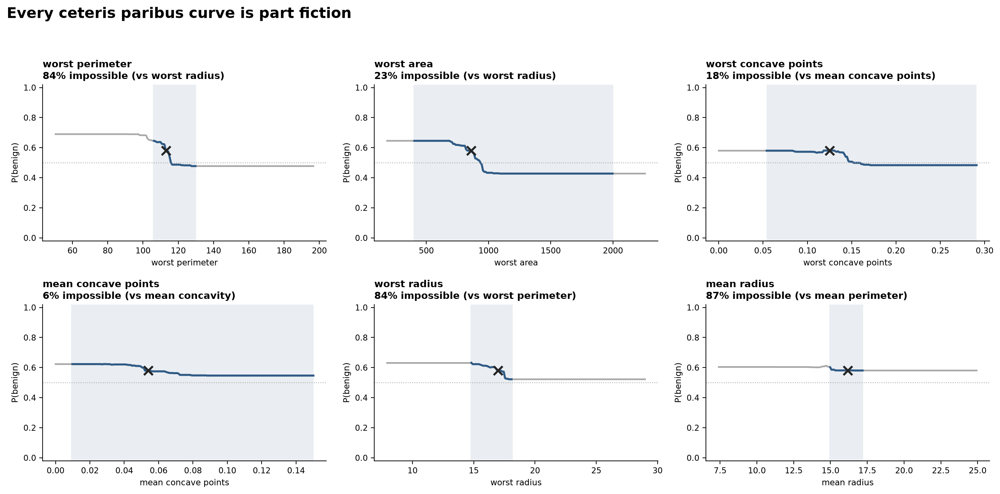

# Module 01 — Ceteris paribus

A worked case study of ceteris paribus profiles — Molnar, *Interpretable Machine Learning*, chapter 12 — on the same RandomForest, the same split and the same patient as module 03, so the course reads as one continuous case.

## Learning objectives

After working through this module you should be able to:

1. Compute a ceteris paribus profile and say exactly which rows it feeds to the model.
2. Explain why a RandomForest profile is a staircase, and why a step's height is a property of the grid rather than of the model.
3. Measure how much of a profile is made of instances that could not exist, and state the criterion you used.
4. Explain why these rows are typical under every marginal and impossible under the joint, and which kind of check can therefore see them.

## Why bother with the simplest method in the course

A ceteris paribus profile needs no surrogate, no sampling scheme and no kernel. Hold everything about one patient fixed, move one measurement across a grid, plot the prediction. Nothing is approximated: the curve is the model's own output, computed and not sketched.

That makes it the honest place to introduce the one problem every later method inherits. Freezing 29 measurements while the thirtieth moves builds patients that could not be biopsied — and because the method is otherwise so simple, there is nowhere for the problem to hide.

## What this module shows

Four steps, all on the same patient and the same feature:

1. The profile itself — a staircase, and where its steps fall.
2. How many of the plotted rows are geometrically impossible.
3. Why the general-purpose check for that fails.
4. Molnar's proposed remedy, applied and measured.

**The case.** Test patient #67, P(benign) = 0.581, and `worst perimeter`, the feature LIME ranks first for her in module 03. The sweep runs ±2.5σ around her value, clipped to the range the feature takes in the data — which on this feature means −1.88σ to +2.5σ, not a symmetric window. The partner feature that gets frozen — `worst radius` — is not chosen for convenience: it is the feature most correlated with the one being swept (|r| = 0.99), which is exactly the case Molnar warns about.

## What the module concludes, and how it is measured

Four results, each printed by the notebook that states it. Two are the chapter's own warnings, quantified here. One is a check that failed, kept for that reason. One is a bridge to module 03.

- **The staircase is real; its steps are not where you think.** Sweeping `worst perimeter` moves P(benign) by 0.212, in 6 steps larger than 0.01. The largest single step is 0.039, across the grid interval 115.1 → 115.8 — but that number is an artefact of the grid: at the same ±2.5σ span it reads 0.094 at 50 grid points and 0.023 at 800, because a finer grid cuts the same jump into more pieces. The swing is stable to three decimals at every resolution *and* at every span — ±1σ, ±2.5σ and ±5σ all give 0.212 — so widening the sweep buys no signal, and the only thing it changes is the impossible fraction below, 64% at ±1σ against 84% at ±2.5σ. Across 12 forest seeds the shape holds (swing 0.116 to 0.181) while the largest step wanders between perimeter 112.1 and 115.1; the lecture's own seed 42 gives 0.212, above all twelve refits, so the headline swing is an upper-tail draw of the seed and should be quoted with that caveat. Quote the swing and the direction; never quote a threshold off one of these plots.

- **Most of the curve is a patient the joint distribution excludes.** Across all 569 real patients the ratio `worst perimeter / worst radius` stays between 6.22 and 7.67. That ratio is *dimensionless*, so unlike a ratio with units it does not drift with tumour size, and a convex closed contour has a floor at 2π ≈ 6.283. But the band is measured rather than derived: its upper edge is a sample maximum, and 11 of the 569 patients sit *below* the 2π floor, the lowest at 6.224. The tempting excuse — that `worst X` averages the three largest nuclei, so the perimeter and the radius need not come from the same one — is false, and the notebook falsifies it: the `mean` block, where both columns average the *same* nuclei, dips further, to 6.175, with 6 of 569 below the floor. The floor is broken because the perimeter is traced on a digitised contour rather than a smooth curve; it is a measurement artefact, not mismatched nuclei. Call it an **empirical dependence envelope with a geometric floor**, not a law. With her radius frozen, the perimeter can only run 105.6 to 130.2, so **84% of the 200 plotted grid points fall outside it — at the ±2.5σ sweep width we chose**. That conditioning matters: at ±1σ it is 64%, and sweeping the feature's full observed range (50 to 251) gives 88%. A 1st–99th percentile band on the same ±2.5σ sweep also gives 88% — a different quantity that happens to round to the same number — so the robust version is less favourable to the method, not more. The six features the forest leans on most do not cluster around a median — they split into three at 6–23% and three at 84–87%. What puts a feature in the high group is not how correlated it is with the partner being frozen but whether their ratio is a tight dimensionless shape factor: |r| = 0.998 gives 87% and |r| = 0.989 gives 24%, `worst area` sits at 23% despite |r| = 0.99 because area/radius carries units and its observed band is 5.05 wide against 1.23 for perimeter/radius, and over all 30 features |r| ranks with the impossible fraction at only ρ = 0.75.

- **The obvious check fails twice, and fixing it is the real lesson.** The natural test is distance: is the manufactured row further from the data than real patients are from each other? It rejects **0%** — but that 0% is arithmetic, not evidence. The patient is herself a row of the dataset, so she is the nearest "real" neighbour at **100%** of the grid points, and the distance being measured is just the displacement along the swept axis: its maximum, 2.500σ, *is* the span we set. With any span below the 4.45σ cutoff the test cannot fire at all. Removing her from the reference set, the verdict then depends entirely on the cutoff — 100% rejected against the median real distance, 21% against the 75th percentile, 0% against the 95th. And a covariance-aware distance settles it: **Mahalanobis rejects 82%** against the envelope's 84%, knowing nothing about anatomy. The counts match; the sets do not — the two verdicts agree point-by-point at 90% of the grid points, with 9 points rejected only by Mahalanobis and 11 only by the envelope, so the result is agreement in order of magnitude between two unrelated criteria, not identity. The general statement is **marginal versus conditional** — these rows are unremarkable under every feature's own marginal and impossible under the joint, which is why a per-feature standardised metric misses them and a whitened one does not. This is also why module 03's attack works: Slack et al. (2020) exploit the fact that such perturbations *are* detectable out-of-distribution.

- **The chapter's remedy is cheap here, which is a result about this feature.** Molnar suggests restricting the curve, and flags that doing so "would also mean we need a model or procedure to tell us what these ranges are" — the envelope above is such a procedure. Doing that keeps 79% of the swing and the crossing of P = 0.5 survives, so the story does not change. The largest step also falls *inside* the possible range. That is the good case; the point of measuring is that you cannot know which case you are in without checking.

The technical companion adds the bridge: a two-point ceteris paribus slope **is** the finite difference module 03 uses to test LIME's direction. On this patient the signs of LIME's eight coefficients and the corresponding CP slopes agree 8 out of 8 — and all eight slopes are nonzero, so all eight are questions the model actually answers. The leading feature's slope then reads −0.106 at ±1σ and −0.753 at ±0.1σ, seven times apart; but almost all of that seven is the 1/h in the definition of a slope. What the model actually does, the change ΔP across the interval, goes only from −0.1506 to −0.2125, a factor of 1.41, and it has already saturated by ±0.5σ. That is module 03's finding in its corrected form: the two modules measure the same object at different resolutions, the **sign** survives the change of resolution — 97% / 100% / 100% at 0.1σ / 0.3σ / 1σ, printed by module 03's §10b table — while the **ranking** and the per-sigma magnitude do not, and a coefficient hides the step it was measured at where a profile shows it.

## Lecture

- **[`lecture/outline.md`](lecture/outline.md)** — the outline the lecture is built from: what to say, what to point at in each figure, and the objections to be ready for.

## Notebooks

- **`notebooks/cp_walkthrough.ipynb`** — the lecture. Builds the profile, measures the impossible fraction two ways, and tests the chapter's remedy.
- **`notebooks/cp_internals.ipynb`** — the technical companion. Checks whether the grid decides the answer, repeats the impossible-fraction measurement over all 30 features, derives why the distance test fails, and connects a CP slope to a LIME coefficient. It refits the forest 12 times, so a full run takes a couple of minutes.

Committed figures are in `figures/`; running the notebooks regenerates them into `notebooks/figures_generated/` (git-ignored), so the canonical figures never change silently.

## A note on configuration

A ceteris paribus plot has two parameters that are almost never reported: how far the sweep goes, and how many points it uses. This module uses ±2.5σ (−1.88σ to +2.5σ once clipped to the observed range) and 200 points, and §2 of the companion shows what each one changes — the resolution changes step heights and nothing else, while the span changes only how much of the curve is fiction, never the swing. Both should be stated whenever one of these plots is shown.

## References

- Molnar, C. *Interpretable Machine Learning* — [Ceteris Paribus chapter](https://christophm.github.io/interpretable-ml-book/ceteris-paribus.html). (Course reference book, chapter 12. The definition used here, the correlation warning, and the range-restriction remedy tested above.)
- Kuźba, M., Baranowska, E., & Biecek, P. (2019). pyCeterisParibus: explaining Machine Learning models with Ceteris Paribus Profiles in Python. *Journal of Open Source Software* 4(37), 1389. [doi:10.21105/joss.01389](https://doi.org/10.21105/joss.01389). (Where the term comes from, and the citation Molnar's own chapter uses. Note that [EMA ch. 10](https://ema.drwhy.ai/ceterisParibus.html) says outright that the method "is also known as 'What-if' model analysis or Individual Conditional Expectations" — outside this ecosystem the object is called an ICE curve.)
- Apley, D. W., & Zhu, J. (2020). Visualizing the Effects of Predictor Variables in Black Box Supervised Learning Models. *JRSS-B* 82(4), 1059–1086. [doi:10.1111/rssb.12377](https://doi.org/10.1111/rssb.12377); Molnar chapter 20. (Accumulated local effects — the method built to compute an effect without ever leaving the joint distribution, i.e. the principled answer to everything this module measures.)
- Goldstein, A., Kapelner, A., Bleich, J., & Pitkin, E. (2015). Peeking Inside the Black Box. *JCGS* 24(1), 44–65. [doi:10.1080/10618600.2014.907095](https://doi.org/10.1080/10618600.2014.907095). (§4.3, "Extrapolation Detection", makes this module's joint-impossibility point first, with a generating process in which each coordinate is unremarkable and the combination has probability zero.)
- Friedman, J. H. (2001). Greedy Function Approximation: A Gradient Boosting Machine. *Annals of Statistics* 29(5), 1189–1232. [doi:10.1214/aos/1013203451](https://doi.org/10.1214/aos/1013203451). (Partial dependence, the average these curves are later aggregated into — module 02.)
- Street, W. N., Wolberg, W. H., & Mangasarian, O. L. (1993). Nuclear feature extraction for breast tumor diagnosis. *IS&T/SPIE 1905*, 861–870. (The [Breast Cancer Wisconsin (Diagnostic)](https://archive.ics.uci.edu/dataset/17/breast+cancer+wisconsin+diagnostic) dataset, as distributed with scikit-learn.)
