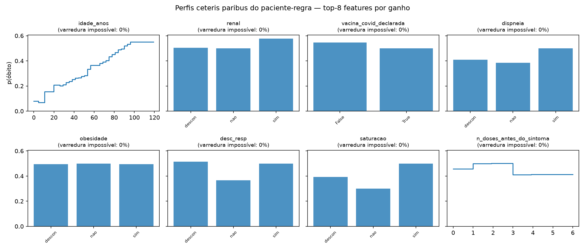

# Módulo 01 — Ceteris paribus

*Autor do módulo: [William Bendinelli](https://github.com/wbendinelli) — SCC5819 (ICMC-USP, 2026).*

Perfis ceteris paribus — Molnar, cap. 12 — sobre **o modelo do curso**:
o XGBoost de óbito por COVID do módulo 00, os dois pacientes-por-regra
que os módulos 02–05 herdam ([MODEL.md](../00-dataset/MODEL.md)). O
método mais simples do curso — *"one of the simplest analysis one can
do"*, diz o capítulo — e por isso o lugar onde o problema que todos os
métodos posteriores herdam não tem onde se esconder. A versão Breast
Cancer vive no histórico do git.

## Objetivos de aprendizagem

Ao fim deste módulo você deve conseguir:

1. Calcular um perfil ceteris paribus e dizer exatamente que linhas ele
   entrega ao modelo.
2. Explicar por que o perfil de uma floresta é uma escadaria — e por que
   a altura de um degrau é propriedade da grade, não do modelo.
3. Contar quantos pontos de um perfil são pacientes impossíveis — e,
   nesta base, **derivar** a conta em vez de estimá-la.
4. Dizer o que o remédio de Molnar (restringir a grade) faz de verdade —
   e quando ele remove a pergunta em vez de respondê-la.

## Por que o método mais simples vem primeiro

A escadaria se paga: no teste (n = 16.142) o XGBoost do curso faz AUC
0,7644 contra 0,7246 da logística treinada na mesma matriz, com Brier
0,1308 contra 0,1452 (walkthrough §setup). Os quatro pontos de AUC são
feitos exatamente daquilo que nenhum coeficiente global exibe —
interações. E o número agregado não diz **em quem** o modelo acerta nem
**por quê**: na base cheia ele é 0,7680, e por ano de início cai de
0,7890 (2020) a 0,7451 (2022) antes de voltar (módulo 00, internals do
modelo §2) — o mundo mudou depois do treino.

O perfil ceteris paribus é o preço mais baixo que se paga para fazer a
pergunta paciente a paciente: sem kernel, sem substituto, sem
amostragem — a curva **é** a saída do modelo. E é justamente por não
aproximar nada que o problema herdado por todos os métodos seguintes
aparece aqui sem disfarce: congelar 39 features enquanto a quadragésima
anda fabrica pacientes que não podem existir, e nesta base essa conta é
derivável.

## O que o módulo mostra

1. **A amplitude é do modelo; o degrau é da grade** (walkthrough §1): refinar
   do passo 10 ao passo 1 deixa a amplitude intacta — 0,4809 nos quatro
   passos — e desmonta o maior salto aparente, de 0,1387 (passo 10) para
   0,0852, que então não cede mais (internals §1). Leia posições de
   corte, nunca alturas de degrau.
2. **O mesmo perfil, dois modelos** (walkthrough §1b — a fig. 12.5 do livro):
   neste paciente a escadaria varre **mais** que a rampa (amplitude
   0,481 contra 0,397 na idade). No perfil de doses os dois discordam
   ponta a ponta — a logística sobe monotonicamente (+0,217, carregando
   o confundimento de quem-se-vacinou), o XGBoost termina abaixo de onde
   começou (−0,044) —, mas o XGBoost não é monótono: sobe até a segunda
   dose, e na vizinhança do próprio paciente a inclinação local é
   positiva (+0,03542, internals §4). O módulo 05 dá a esse
   confundimento um número.
3. **Se a varredura fabrica ficção depende de quem** (walkthrough §2): o
   paciente-regra — 90 anos, uma comorbidade declarada, início
   pós-campanha — é imune a duas cercas e cai na terceira; o vulnerável
   — mesma regra |p−0,5|, restrita ao estado vulnerável — transforma
   toda varredura em ficção (diabetes 1/1, doses 6/6). Na amostra:
   37,3% atrás do portão, 29,7% pré-campanha, 79,6% com o critério por
   um fio.
4. **A distância não vê contradição lógica** (walkthrough §3): o ponto
   impossível fica a Gower 0,0037 do dado real — mais perto que o
   possível (0,1287) e mais perto do que o paciente real mediano fica do
   vizinho dele (0,0046). `gate_impossible` vê; a geometria, não.
5. **O remédio de Molnar, medido** (walkthrough §4): pós-campanha, a grade
   restrita preserva a curva inteira (0,0896 → 0,0896, 0 de 7 pontos
   impossíveis); pré-campanha, ela a **remove** (0,0119 → 0,0000, 6 de 7
   impossíveis) — restringir funciona dizendo quando não perguntar.

## O que o módulo conclui, e como isso é medido

- **A limitação que o capítulo nomeia vira contagem derivável.** Molnar
  avisa (fig. 12.3 do livro) que mover uma feature com as outras paradas
  cria combinações irreais; na era BCW isso era um envelope empírico com
  piso geométrico, furado por 11 pacientes. Aqui as cercas são exatas —
  portão do funil (0,00% de contradição em seis anos), calendário da
  campanha, definição da coorte — centralizadas em `M.gate_impossible`
  e idênticas nos módulos 02–05 por construção. E a contagem é de quem
  pergunta tanto quanto do método: para o paciente-regra as oito
  features de maior ganho dão **0% de varredura impossível** (walkthrough
  §painel); a concentração da ficção é propriedade da coorte, medida
  feature a feature no internals §3 (21 das 40 features têm varredura
  sempre segura).
- **A lição da semente inverteu** (internals §2): sem subsampling, o
  XGBoost `hist` é determinístico — 12 sementes, correlação 1,0000
  entre perfis; ligada a aleatoriedade (subsample 0,8), 0,9978. O
  fantasma do RandomForest da era BCW não mora aqui; a instabilidade
  mudou de endereço (grade e composição do treino).
- **A inclinação local do perfil é o objeto que o LIME estima** — e a
  ponte honesta é regional, não pontual (módulo 03, internals §6: a
  inclinação pontual da escadaria troca de sinal com o passo). O perfil
  de doses deste módulo mostra a armadilha sem sair de casa: ele desce
  ponta a ponta (−0,044) e sobe no paciente (+0,03542).

Todos os números acima são do modelo do curso adotado em 2026-09-01
(800 árvores, profundidade 4, lr 0,05 — módulo 00, SELECTION.md); a
versão anterior deste módulo os media no modelo de 400 árvores /
profundidade 5, e o paciente-regra era outro (gold_id 1269214). O
deslocamento é de condicionamento, não de falsificação; as afirmações
que a medição derrubou estão listadas abaixo.

### O que ficou registrado como corrigido

A barra de evidência (regra 3) manda o valor antigo ficar no registro
quando a medição derruba a prosa. As quatro desta revisão:

- **A amplitude não converge com a grade — ela nunca se moveu.** Esta
  página dizia que refinar do passo 10 ao passo 1 movia a amplitude de
  0,288 para 0,331; no modelo do curso ela é 0,4809 nos quatro passos
  (internals §1). O que a grade move é o degrau (0,1387 → 0,0852), e a
  lição — leia posições de corte, não alturas — sai mais limpa do que
  entrou.
- **A rampa não é a mais agressiva.** A prosa dizia que a logística
  varria mais que a escadaria na idade (amplitude 0,718 contra 0,330).
  Medido (walkthrough §1b), é o contrário: 0,481 da escadaria contra
  0,397 da rampa. O que sobrevive da comparação é a **forma** — a
  logística desenha a mesma curva para todo paciente, só mudando o
  nível —, não o tamanho.
- **"O XGBoost desce nas doses" era ler a ponta, não o paciente.** A
  prosa dizia que os dois modelos discordavam de direção, a logística
  subindo e o XGBoost descendo de leve. O desacordo sobrevive ponta a
  ponta (+0,217 contra −0,044), mas o perfil do XGBoost **não é
  monótono**: sobe até a segunda dose e só então cai, e a inclinação
  local no próprio paciente é positiva (+0,03542, internals §4).
- **Os números de Gower já estavam errados antes da troca de modelo.**
  Esta página e o outline citavam 0,043 no ponto impossível, 0,130 no
  possível e 0,005 na mediana dos reais; a célula commitada imprimia
  0,0491, 0,1364 e 0,0046 — a prosa nunca bateu com o caderno. No
  modelo do curso os valores são 0,0037, 0,1287 e 0,0046, e o achado
  ficou mais forte: o ponto impossível está mais perto de um paciente
  real do que o paciente real mediano está do vizinho dele.

Uma correção de citação, na mesma passada: o caderno imprimia as frações
da base cheia como 38,07 / 34,51 / 78,83 / 23,67% apontando para o
"internals §6 do modelo". O módulo 00 mede 38,05 / 34,50 / 78,83 /
23,66% e a seção é a **§5** (as quatro impossibilidades); a linha
impressa foi corrigida.

## Aula

[`lecture/outline.md`](lecture/outline.md) — a forma viva da aula.

## Notebooks

- [`notebooks/cp_walkthrough.ipynb`](notebooks/cp_walkthrough.ipynb) — a
  aula: o método termo a termo, a escadaria, os dois modelos, as três
  cercas com os dois pacientes, Gower e o remédio medido. Amostra
  commitada, sem rede, ~10 s.
- [`notebooks/cp_internals.ipynb`](notebooks/cp_internals.ipynb) — o
  companheiro que prova: a grade (o degrau é dela), os dois regimes de
  semente, a ficção feature a feature e a ponte para o LIME. ~20 s.

As figuras commitadas estão em `figures/`; rodar os notebooks as
regenera em `notebooks/figures_generated/` (git-ignorado).

## Referências

- Molnar, C. *Interpretable Machine Learning*, 3ª ed. — [cap. 12 (Ceteris Paribus)](https://christophm.github.io/interpretable-ml-book/ceteris-paribus.html). (Livro-texto: a definição, a comparação entre modelos da fig. 12.5, a limitação das combinações irreais e a advertência causal.)
- Base, modelo, pacientes e cercas: módulo 00 ([MODEL.md](../00-dataset/MODEL.md), [GOLD.md](../00-dataset/GOLD.md), [gold/MANIFEST.md](../00-dataset/gold/MANIFEST.md)).
