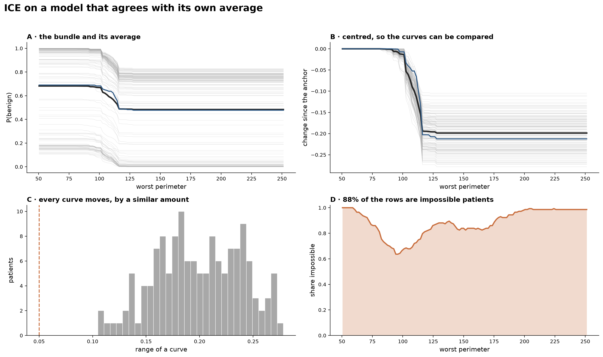

# Module 02 — ICE

A worked case study of individual conditional expectation curves — Molnar, *Interpretable Machine Learning*, chapter 13 — on the same RandomForest, the same split and the same patient as modules 01 and 03.

## Learning objectives

After working through this module you should be able to:

1. State the relationship between a ceteris paribus curve, an ICE plot and a PDP, and compute all three.
2. Measure whether a PDP is hiding disagreement, instead of assuming it is.
3. Use centred and derivative ICE, and say which question each one answers.
4. Recognise a negative result and report it, rather than reaching for a dataset where the story works.

## Why bother stacking curves

Module 01 drew one ceteris paribus curve. An ICE plot is the same computation run for everybody; Molnar says so directly — *"ICE plots are CP plots containing all CP curves for an entire dataset."* Nothing new is computed.

What is new is the **question**. A partial dependence plot is the average of these curves, and an average can be flat while every individual moves, or rise while a third of the population falls. Goldstein et al. proposed ICE in 2015 precisely to expose that. So the honest use of this module is not to demonstrate the phenomenon but to *test* for it — and to accept the answer.

## What this module shows

Five steps on 143 test patients and one feature, 17,160 calls to the model:

1. The bundle, with its average drawn through it.
2. How much each curve moves — a prediction of ours that failed.
3. Centred ICE, which compares curves that start at different levels.
4. How much the average hides — a second prediction that failed.
5. The off-manifold cost from module 01, multiplied by 143.

**The case.** `worst perimeter`, swept across its full observed range (50 to 251) for every test patient. Patient #67's curve is drawn in blue so module 01's single profile can be found inside the bundle.

## What the module concludes, and how it is measured

Two of the three things this module set out to show did not happen. They are kept, with their measurements, because the instrument that refuted them is the instrument the chapter is about.

- **We predicted most curves would be flat. Not one is.** The reasoning was that module 03 measures 71% of held-out real patients sitting in a saturated prediction, and a saturated patient has nowhere to move. The measurement: curve range has a median of 0.199, and **0 of 143 patients move less than 0.05** — with the caveat that the smallest range in the sample is 0.105, twice the threshold, so that zero was fixed by the choice of threshold and the median is the number that carries information. Borderline and confident patients move by the same amount (median 0.206 against 0.195) and the correlation between confidence and movement is −0.09. The reasoning was wrong because saturation describes patients *at their own feature values*; sweeping a strong feature across its whole range is a large enough move to pull anyone across the region where the forest changes its mind. Flat curves do appear in the companion — up to 43% — but only for weak features, where the median range is 0.055 for everybody, so those curves are flat because the feature does nothing to anyone.

- **We predicted the average would be hiding disagreement. It is not.** Where the PDP is steepest — the point at which a summary would be most misleading — **0%** of the moving patients go the other way. Across the ten features the forest leans on most, the median at that point is 0% and the worst case is 4%. All 143 patients end lower than they started. On this model the PDP is a faithful summary. Neither finding is a grid artefact: coarser, finer and narrower sweeps give the same verdict to three decimals.

- **The instrument is not blind, but its scope is narrower than one control shows.** A control model was built so the effect of `worst perimeter` flips sign with `worst texture`, and the identical code run on it gives **52%** disagreement against 0% on the cancer forest, with its PDP swinging 0.028 while the median patient swings 0.135 — Goldstein's failure reproduced on demand. Dialling that interaction from 0 to full strength, though, the statistic reads **0% up to half strength**: an interaction strong enough to cut the PDP swing from 0.255 to 0.139 is invisible to it. So the 0% on the cancer forest rules out an interaction *as extreme as the control*, not interaction in general. The better summary, from ingredients we already had, is **PDP swing ÷ median individual swing**, which is 1.00 on the cancer forest — the maximally faithful value — and collapses to 0.21 on the control.

- **Derivative ICE agrees with raw ICE — a third negative finding.** An earlier version of this module reported "18–55% of patients slope against the average" and concluded d-ICE was the more sensitive instrument. That was a bug: the statistic counted patients whose derivative is *exactly zero* as disagreeing, and on a piecewise-constant forest most patients are standing still at any grid point. Masked properly, genuine sign disagreement is **2–11%**. What patients do differ in is magnitude — the coefficient of variation of net change runs 0.20 to 0.47 — so the honest summary is that this forest has no sign heterogeneity by either instrument.

- **And the same bill arrives, at the same rate.** Of the 17,160 rows this plot feeds to the model, **88% fall outside the dependence envelope**, and there is no patient for whom less than half the curve is outside it. Across all ten top features the median is **60%**, with the features splitting into a radius/perimeter/area block above 50% and a concavity block below — and only the dimensionless ratios among them are genuine shape constraints.

  Do not line these up against the other modules as a table. The 84% of module 01 and the 88% here differ *only* because this plot sweeps wider: run module 01's ±2.5σ grid over all 143 patients and it is 84% again; run this full-range grid on her alone and it is 88%. Going from 1 patient to 143 changes the rate by zero, so nothing is "multiplied". And module 03's 76% is a different criterion altogether. What is comparable across the course is the habit, not the percentage.

## Lecture

- **[`lecture/outline.md`](lecture/outline.md)** — the outline the lecture is built from, including how to teach a negative result without it sounding like an apology.

## Notebooks

- **`notebooks/ice_walkthrough.ipynb`** — the lecture. The bundle, the two failed predictions, centred ICE, and the off-manifold measurement.
- **`notebooks/ice_internals.ipynb`** — the technical companion. Repeats both findings over ten features, adds derivative ICE, checks the grid, and builds the interacting control model that proves the instrument works. It computes several 143 × 120 sweeps, so a full run takes a few minutes.

Committed figures are in `figures/`; running the notebooks regenerates them into `notebooks/figures_generated/` (git-ignored), so the canonical figures never change silently.

## A note on configuration

ICE curves here are drawn over each feature's **full observed range**, not a trimmed one. That choice maximises the impossible fraction reported above, and a narrower sweep would look better. The companion runs the 5th–95th percentile version and a ±1 SD version: the swing and both findings are unchanged to three decimals, because even the narrow sweeps still span the region where the forest changes its mind. The full range is kept because it is what the common implementations do by default.

## References

- Molnar, C. *Interpretable Machine Learning* — [ICE chapter](https://christophm.github.io/interpretable-ml-book/ice.html). (Course reference book, chapter 13. The definitions of centred and derivative ICE used here, and the statement that ICE plots are ceteris paribus curves for a whole dataset.)
- Goldstein, A., Kapelner, A., Bleich, J., & Pitkin, E. (2015). Peeking Inside the Black Box: Visualizing Statistical Learning with Plots of Individual Conditional Expectation. *Journal of Computational and Graphical Statistics* 24(1), 44–65. [doi:10.1080/10618600.2014.907095](https://doi.org/10.1080/10618600.2014.907095); [arXiv:1309.6392](https://arxiv.org/abs/1309.6392). (The paper that proposed ICE as a correction to PDP's averaging. Its central claim is the one tested — and not confirmed — above. Two parts of it this module should adopt rather than reinvent: §4.3 "Extrapolation Detection", and §6's visual test for additivity, which is a proper significance test for exactly the null measured here.)
- Apley, D. W., & Zhu, J. (2020). Visualizing the Effects of Predictor Variables in Black Box Supervised Learning Models. *JRSS-B* 82(4), 1059–1086. [doi:10.1111/rssb.12377](https://doi.org/10.1111/rssb.12377); Molnar chapter 20. (Accumulated local effects. The off-manifold cost measured above is exactly what ALE was designed to avoid, so the sequence does not in fact end without an answer.)
- Friedman, J. H. (2001). Greedy Function Approximation: A Gradient Boosting Machine. *Annals of Statistics* 29(5), 1189–1232. [doi:10.1214/aos/1013203451](https://doi.org/10.1214/aos/1013203451). (Partial dependence, the average ICE was invented to disaggregate.)
- Street, W. N., Wolberg, W. H., & Mangasarian, O. L. (1993). Nuclear feature extraction for breast tumor diagnosis. *IS&T/SPIE 1905*, 861–870. (The [Breast Cancer Wisconsin (Diagnostic)](https://archive.ics.uci.edu/dataset/17/breast+cancer+wisconsin+diagnostic) dataset, as distributed with scikit-learn.)
