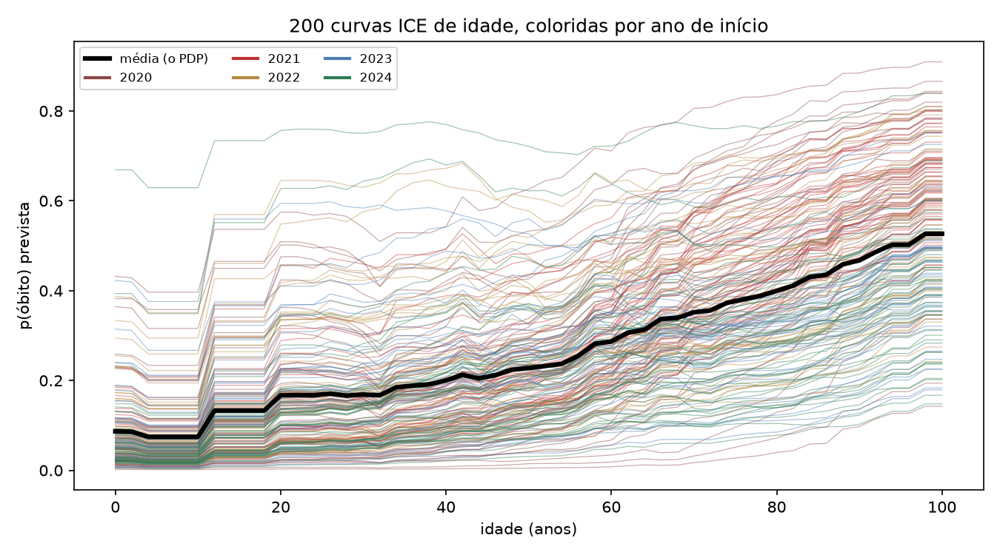

# Módulo 02 — ICE (expectativa condicional individual)

Curvas ICE — Molnar, *Interpretable Machine Learning*, cap. 13 — sobre o
modelo do curso ([MODEL.md](../00-dataset/MODEL.md)): o XGBoost de óbito
por COVID, os mesmos 200 pacientes por regra declarada (40 por ano de
início, semente 42). "ICE plots são perfis CP para o dataset inteiro" — o
módulo 01 desenhou uma curva; este desenha o feixe, e ganha o que o CP não
tem: **heterogeneidade**, que nesta base tem nome: **regime**. A versão
Breast Cancer deste módulo vive no histórico do git.

## Objetivos de aprendizagem

Ao fim deste módulo você deve conseguir:

1. Construir um feixe ICE com regra de amostragem declarada e dizer que
   linhas ele entrega ao modelo.
2. Ler a heterogeneidade que o PDP esconde — e explicar quando o PDP
   mente por nível, mesmo acertando a forma.
3. Usar ICE centrado e derivada para separar nível, forma e onde o efeito
   mora.
4. Contar, por feixe, quantos pontos são pacientes impossíveis — e prever
   a conta pela cerca, antes de medir.

## O que o módulo mostra

1. **O feixe estratifica por regime**: aos 80 anos, a probabilidade média
   é 0,48 nos pacientes de 2020 e 0,32 nos de 2023–24; o PDP reporta
   0,407 — um número que não descreve nenhum regime.
2. **ICE centrado separa nível de forma**: o ganho 0→100 anos varia de
   0,23 (p10) a 0,62 (p90) entre pacientes, com correlação mediana de
   0,965 entre cada curva e a média — forma quase paralela, níveis muito
   diferentes. Para idade, o PDP acerta a forma e erra o nível de todos ao
   mesmo tempo: o modo de mentir mais educado que existe (internals §2).
3. **A derivada tem o pico na ponta pediátrica**: 0,023/ano aos 10 anos —
   sair da primeira infância mexe mais que envelhecer no miolo (mediana
   0,003 em 40–54) — herança da coorte pré-COVID (bronquiolite); o efeito
   de idoso vem depois dos 55, mais suave (máx. 0,014).
4. **Quem são as linhas, vezes 200**: o feixe de idade é logicamente
   seguro (0 de 10.200 pontos contradizem cerca); o de doses fabrica 252
   de 1.400 (18% — exatamente os 42 pacientes pré-campanha × 6); o de
   tosse, 54% (internals §3). A escolha da feature varrida decide se o
   feixe é retrato ou fábula — e a conta é derivável, pela mesma
   `gate_impossible` dos módulos 00–01.

## Aula

[`lecture/outline.md`](lecture/outline.md).

## Notebooks

- [`notebooks/ice_walkthrough.ipynb`](notebooks/ice_walkthrough.ipynb) —
  feixe, centrado, derivada e as duas contagens; amostra commitada, sem
  rede.
- [`notebooks/ice_internals.ipynb`](notebooks/ice_internals.ipynb) —
  dispersão/amplitude por feature, quando o PDP não mente, e o custo da
  cerca por feixe.

## Referências

- Molnar, C. *Interpretable Machine Learning*, 3ª ed., cap. 13 (ICE).
- Goldstein, A. et al. (2015). *Peeking Inside the Black Box: Visualizing
  Statistical Learning with Plots of Individual Conditional Expectation.*
  JCGS 24(1).
- Base, modelo e cercas: módulo 00.
