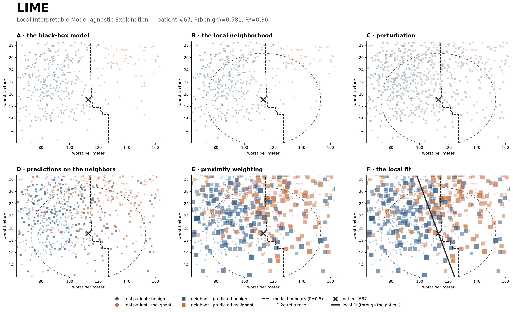

# Module 03 — LIME

A worked case study of Local Interpretable Model-agnostic Explanations (LIME) on a RandomForest trained on scikit-learn's Breast Cancer Wisconsin (Diagnostic) dataset (569 patients, 30 features, benign/malignant).

## Learning objectives

After working through this module you should be able to:

1. State what LIME optimizes and name each term of its objective.
2. Follow the mechanism end to end: perturb → predict → weight → fit.
3. Say which parts of a local explanation are trustworthy (the direction) and which are not (the level), and cite the measurement that separates them.
4. Explain why the neighborhood LIME builds is not made of plausible patients, and what that costs.

## Why bother explaining this model

Under 10-fold cross-validation over all 569 patients the RandomForest reaches 95.3% accuracy — but that number is carried by the easy cases. Split by confidence: where the model is confident (|P − 0.5| > 0.30, n = 492) it is right **99.4%** of the time; where it hesitates (|P − 0.5| < 0.15, n = 34) it is right **52.9%** of the time, barely better than a coin flip. Those 6% of patients are the ones a clinician would take to a second opinion, and they are what this module is about.

## What this module shows

Six steps, all plotted in the same fixed window so nothing moves between them except what LIME adds:

1. The black-box model — the decision surface of the RandomForest.
2. The local neighborhood — the region around the instance being explained.
3. Perturbation — synthetic samples generated around that instance.
4. Model predictions on the neighbors — how the black box scores each one.
5. Proximity weighting — how neighbors are weighted by distance.
6. The local fit — a Ridge regression on the weighted neighbors.

**The case.** Test patient #67, P(benign) = 0.581, predicted and truly benign, plotted against `worst perimeter` and `worst texture`. Patient #67 sits on the decision boundary, which is required rather than convenient: the distance from a patient to the fit's P=0.5 contour equals |g(x) − 0.5| ⁄ ‖w‖, so for a confidently classified patient that contour is *forced* far away and the figure degenerates. The two plotted axes are the patient's rank-1 and rank-**3** features — across the dataset the rank-2 feature correlates with rank 1 at a median of 0.98, so a strict "top two" rule would collapse the real patients onto a near 1-D ribbon. Three other test patients meet the same conditions; #67 is used because its plottable second axis sits highest in the ranking. Both points are legibility choices, stated as such in the notebook, not properties of the data.

## What the module concludes, and how it is measured

Four results, each measured in `lime_internals.ipynb` rather than asserted. One restates a published theorem and checks it against this run; one is a limitation the literature names and this module quantifies; one is our own measurement of direction against level; and the last is a claim of ours that **did not survive replication**, kept here for that reason.

- **A local fit's direction is trustworthy at the scale LIME samples; its level is not.** For this patient the fit's gradient points 4° from the direction the model's probability actually changes (cosine 0.997 in the plotted plane) — but g(x) = 0.50 against the model's f(x) = 0.58, a *stable bias*, σ ≈ 0.003 across runs. Drawing the conventional P=0.5 contour would place this patient on the malignant side of that same explanation in 5 of 8 runs, so the figures draw the fit **through the patient** instead. That in-plane figure is one patient in a plane spanned by that patient's own leading features, so it is measured across all 143 test patients in §10b — and the answer depends on the scale the question is asked at. Against a central finite difference the leading coefficient carries the right sign in **97% of the patients whose leading feature moves at all at 0.1σ, and 100% at 0.3σ and 1σ** — the sign is not the scale-dependent quantity. What is scale-dependent is how often the forest moves (83 of 143 have a flat leading feature at 0.1σ, 21 at 1σ) and the ranking: the median 30-D cosine goes 0.16 → 0.36 → **0.81** and the leading feature among the model's three most sensitive in 80% of patients. One σ is not an arbitrary choice: LIME draws each feature from a standard normal, so every probe row it sees is displaced about one standard deviation per feature. Finer than that is a region LIME never visited. The rule is therefore not "trust the direction" but **trust the direction at the scale LIME actually sampled** — a statement about a wide region, not a derivative at the patient, which is Break 1 arriving at its conclusion.

- **LIME's proximity kernel is nearly inert at the default width — which is where the level bias comes from.** This is a published result, not one of ours. Garreau and von Luxburg show, in *Looking Deeper into Tabular LIME* (§3.2.3), that at the package default ν = 0.75√d "the bandwidth parameter then becomes redundant: it is equivalent to give weight 1 to every perturbed sample". Their AISTATS paper of the same year makes a different point about the bandwidth — a switch-off phenomenon in which a coefficient is driven to zero at a critical width — so the two should not be conflated. What this module contributes is the verification. Refitting with the kernel weights deleted entirely moves g(x) by a median 0.002 across six patients spanning the confidence range (up to 0.013 for the most confident of them), leaves every selected feature in place, and leaves the coefficient direction aligned at cosine 0.9999; the half-weight contour sits at 4.84σ, so 42% of all 569 real patients carry a weight above 0.5. Repeating the deletion across four datasets and three model classes (§11b), the selected features survive 92–100% of the time — with one honest qualification the single-dataset version hides: the effect is dimension-dependent, and in a four-feature control the kernel does bite (median |Δg| = 0.063 against 0.008 at p = 30). The module reports that dependence as measured and does not claim a mechanism for it. With the default ν = 0.75√p the "local" fit is very nearly a *global* linear approximation of f over the perturbation cloud, and a global fit explaining a third of the variance shrinks its predictions toward that cloud's mean of ≈0.48 — which is why g(x) lands near 0.5 almost regardless of which patient is being explained. Worth stating plainly: a narrow bandwidth drives every coefficient to zero, so the wide default is not simply careless. But it is not principled either — the same authors, in that AISTATS paper (§4, "Influence of the bandwidth"), write that their theorem "does not provide directly a founded way to pick ν" and that "the quest for a founded heuristic is still open".

- **LIME's neighborhood is not made of possible patients.** Molnar lists sampling that ignores feature correlation among LIME's limitations; this module measures what it costs here. Drawing each feature independently from its own marginal breaks the correlations that make a tumour measurable: about three quarters of the synthetic patients carry at least one negative measurement, and the perimeter-to-radius ratio — 6.22–7.67 in real data — spans roughly 1.8 to 21.5 in the cloud. The consequence is not only cosmetic. Because those perturbations are detectable as out-of-distribution, Slack et al. (2020) were able to build a classifier that behaves differently on them and so hides its racial bias from LIME.

- **R² does not measure explanation quality — and our attempt to say what it *does* measure failed.** On this dataset with this model, R² tracks how *confident* the prediction was (Spearman ρ = +0.612, p ≈ 4×10⁻¹⁶ over 143 test patients). Two candidate mechanisms were tested and both are measurably false: the model essentially never saturates where LIME samples (2 of 5,000 draws, against 71% of held-out real patients), and the kernel weights are nearly uniform for everyone. Replication then removed the finding itself. Under one common protocol (55 patients, 2,000 samples), the correlation is +0.70 for our setting, weakens to +0.27 and +0.17 (n.s.) when the model is swapped for a gradient boosting machine and a logistic regression, and vanishes at **−0.07 (n.s.)** on an unrelated dataset (wine). The literature offers no rescue either: Velmurugan et al. (2020) evaluate LIME and SHAP fidelity across three process-mining datasets — with a perturbation-based measure rather than LIME's own R² — and report "no pattern or trend of faithfulness with regards to … the initial probability", with one of their settings running the other way entirely. So the honest statement is not "R² measures confidence" — it is that **you cannot know in advance what R² is correlated with in your own setting**, which is a stronger reason for the practical rule, not a weaker one: **do not rank explanations by R².**

## Lecture

- **[`lecture/lime-seminar.pdf`](lecture/lime-seminar.pdf)** — the 20-slide deck as delivered, in three acts: *what it computes*, *where it falls short*, *how to read it*. It opens directly on the method; the motivation in the outline's §1 is spoken, not projected. Slide 06 shows all six mechanism steps at once before the walk-through, and the deck ends on four rules rather than a summary, then on Molnar's own conclusion — that the method "is still in the development phase and many problems need to be solved before it can be safely applied". **[`lecture/lime-seminar-16x10.pdf`](lecture/lime-seminar-16x10.pdf)** is the same deck letterboxed to 16:10 (bars in each slide's own background colour) for MacBook screens, whose viewers fit the page height and crop a 16:9 deck at the right edge; use it when presenting from the laptop, the 16:9 file on a 16:9 projector.
- **[`lecture/outline.md`](lecture/outline.md)** — the outline the deck is built from: what to say, what to point at in each figure, and the objections to be ready for.

## Notebooks

- **`notebooks/lime_walkthrough.ipynb`** — the lecture. Builds the six steps, shows what LIME actually returns (the effect chart), and measures direction, level, and fidelity.
- **`notebooks/lime_internals.ipynb`** — the technical companion, which proves what the lecture asserts. It reproduces the package's perturbation, kernel and `highest_weights` selection from scratch and checks them against the installed source (`lime_tabular.py`, `lime_base.py`) — including the detail that the local model is fitted in *standardized* space, a trap that silently changes the selected features (8/8 agreement done right, 5/8 done wrong). It also runs the instance search, measures the off-manifold sampling and the R²-versus-confidence relationship, and quantifies instability. Its sweep fits one explanation per test patient (143 × 5,000 samples), so a full run takes a few minutes.

Committed figures are in `figures/`; running the notebooks regenerates them into `notebooks/figures_generated/` (git-ignored), so the canonical figures never change silently.

## A note on configuration

The notebooks pass `discretize_continuous=False`, overriding the package default. With the default, LIME bins each feature into quartiles and phrases explanations as intervals ("`worst perimeter` > 120") — the form used in Molnar's book and most tutorials. Turning it off keeps features continuous, which is what allows the explanation to be drawn as a line. Same algorithm, different presentation; worth knowing before comparing these outputs to others.

## References

- Ribeiro, M. T., Singh, S., & Guestrin, C. (2016). ["Why Should I Trust You?": Explaining the Predictions of Any Classifier](https://arxiv.org/abs/1602.04938). *KDD 2016*. (The original LIME paper.)
- Molnar, C. *Interpretable Machine Learning* — [LIME chapter](https://christophm.github.io/interpretable-ml-book/lime.html). (Course reference book. Of the limitations he lists, three are measured here: neighborhood definition, sampling that ignores feature correlation, and instability across runs.)
- Garreau, D., & von Luxburg, U. (2020). [Explaining the Explainer: A First Theoretical Analysis of LIME](https://proceedings.mlr.press/v108/garreau20a.html). *AISTATS 2020*. (The theoretical analysis of tabular LIME, and the source of the "founded heuristic" remark, §4. The specific large-bandwidth result verified above is in the companion paper, [*Looking Deeper into Tabular LIME*](https://arxiv.org/abs/2008.11092), §3.2.3.)
- Slack, D., Hilgard, S., Jia, E., Singh, S., & Lakkaraju, H. (2020). [Fooling LIME and SHAP: Adversarial Attacks on Post hoc Explanation Methods](https://dl.acm.org/doi/10.1145/3375627.3375830). *AIES 2020*. (What off-manifold sampling costs, taken to its conclusion.)
- Velmurugan, M., Ouyang, C., Moreira, C., & Sindhgatta, R. (2020). [Evaluating Explainable Methods for Predictive Process Analytics: A Functionally-Grounded Approach](https://arxiv.org/abs/2012.04218). (Finds no consistent relationship between explanation fidelity and prediction probability, and one setting where it runs opposite to ours — part of why the finding above is presented as withdrawn. Note their fidelity measure is a perturbation MAPE, not LIME's R²; the same authors' CAiSE 2021 paper, [*Evaluating Fidelity of Explainable Methods for Predictive Process Analytics*](https://doi.org/10.1007/978-3-030-79108-7_8), extends this line.)
- Alvarez-Melis, D., & Jaakkola, T. (2018). [On the Robustness of Interpretability Methods](https://arxiv.org/abs/1806.08049). (Instability across runs.)
- [`marcotcr/lime`](https://github.com/marcotcr/lime) — the reference implementation validated in `lime_internals.ipynb`.
- Street, W. N., Wolberg, W. H., & Mangasarian, O. L. (1993). Nuclear feature extraction for breast tumor diagnosis. *IS&T/SPIE 1905*. (The [Breast Cancer Wisconsin (Diagnostic)](https://archive.ics.uci.edu/dataset/17/breast+cancer+wisconsin+diagnostic) dataset, as distributed with scikit-learn.)
