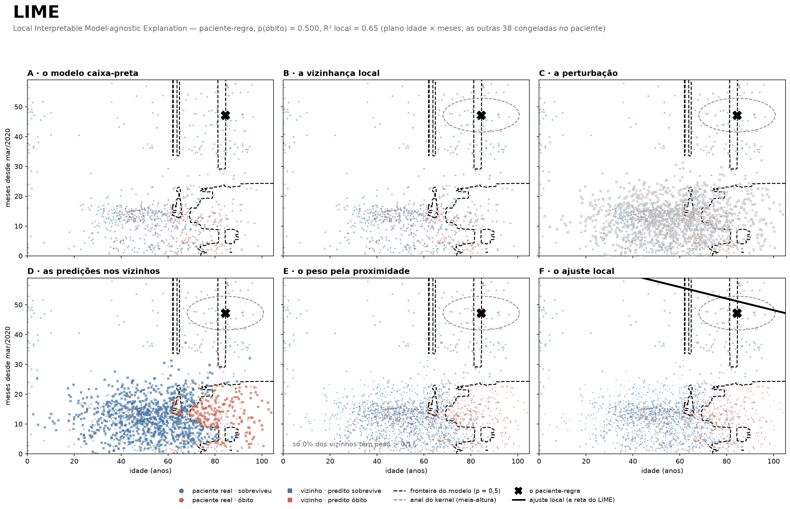
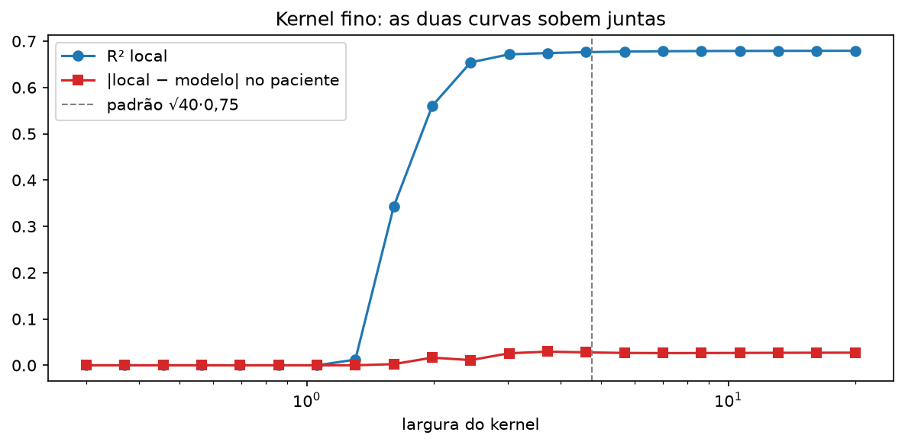

# Módulo 03 — LIME

*Autor do módulo: [William Bendinelli](https://github.com/wbendinelli) — seminário apresentado em 2026-08-24, SCC5819 (ICMC-USP, 2026), sobre a era BCW deste módulo; os decks daquela aula estão preservados em [`lecture/`](lecture/).*

Um estudo de caso de *Local Interpretable Model-agnostic Explanations*
(LIME — Molnar, cap. 14) sobre **o modelo do curso**: o XGBoost de óbito
por COVID do módulo 00, explicado nos mesmos dois pacientes-por-regra dos
módulos 01–02. A versão Breast Cancer vive no histórico do git; o arco
que sobreviveu dela — medir o impossível, depois medir a checagem que
deveria tê-lo pego — agora corre sobre cercas **deriváveis**, não
estimadas.

## Objetivos de aprendizagem

Ao fim deste módulo você deve conseguir:

1. Enunciar o que o LIME otimiza e nomear cada termo do objetivo.
2. Seguir o mecanismo de ponta a ponta — perturbar → prever → pesar →
   ajustar — e apontar, nos painéis A–F, onde cada termo vive.
3. Contar as duas contaminações distintas da vizinhança sintética —
   códigos que nem paciente são (gramática) e pacientes que não podem
   existir (biologia) — e dizer qual delas `categorical_features`
   conserta.
4. Dizer que parte de uma explicação local merece confiança, em que
   escala, e citar a medição que separa essa parte do resto.

## Por que explicar este modelo

O AUC de teste — 0,7644 na amostra deste módulo (walkthrough, célula de
setup; a logística de referência fica em 0,7246) e 0,7680 na base cheia
(módulo 00, internals do modelo §1) — esconde o que importa: o modelo foi
treinado em 2020–2022 e o mundo mudou. O AUC por ano de início cai de
0,7890 (2020) para 0,7680 (2024), e a probabilidade média prevista deriva
junto (módulo 00, internals do modelo §2). Um número agregado não diz
**em quem** o modelo ainda acerta nem **por quê** — e é para essa
pergunta, paciente a paciente, que os métodos locais existem. O LIME é o
primeiro do curso que responde com uma atribuição por feature; este
módulo mede o preço da resposta.

## O que o módulo mostra

**§0 — o método inteiro numa figura.** Os seis painéis A–F da era BCW,
refeitos: o modelo caixa-preta, a vizinhança, a perturbação, as
predições, o peso, o ajuste — no plano idade × meses, que é um corte
ceteris paribus do XGBoost real (módulo 01), não um modelo de brinquedo.
A figura já contém as três surpresas que o resto do notebook conta: a
nuvem não é centrada no paciente (ele está a **6,7 desvios** do centro
dela), o kernel descarta quase tudo (só **0,1%** dos vizinhos com peso
> 0,1), e a reta final é ajustada nesse deserto.

**§1–§6 — duas rodadas e três medições**, com os dois pacientes-por-regra
(o paciente-regra, |p−0,5| mínimo; o vulnerável, mesma regra restrita ao
estado vulnerável às três cercas):

1. **Rodada ingênua** (nenhuma categórica declarada): 4.999/5.000
   vizinhos com código fabricado; idade sintética de −12,6 a +126,9
   anos; 34,3% com doses negativas. Nada avisa — o wrapper de predição
   arredonda em silêncio, e aqui ele tem um contador.
2. **Rodada correta** (36 discretas declaradas): 0 códigos fabricados,
   pesos com nome de gente — e as cercas **conjuntas** ficam: 30,6% dos
   vizinhos do paciente-regra e 79,2% dos do vulnerável são impossíveis,
   pela mesma `gate_impossible` dos módulos 00–02.
3. **R² ≠ fidelidade ao paciente**: kernel estreito dá a explicação
   vazia perfeita (R² 0,00, erro 0,00); largo, R² 0,68 com erro 0,028 no
   próprio paciente. As duas curvas sobem juntas.
4. **Estabilidade**: 10 sementes, top-5 idêntico (Jaccard 1,00) e zero
   trocas de sinal no top-8 — topo firme. A areia está na posição
   seguinte: 3 das 8 features do topo somem do top-10 em alguma semente,
   e o mínimo volta a 0,43 com nuvens de 1.000 (internals §5).

## O que o módulo conclui, e como isso é medido

Quatro resultados, cada um medido em célula (walkthrough ou internals) em
vez de afirmado. Um quantifica uma limitação que o livro nomeia; um é
lido no código-fonte da lib e então medido; dois são medições nossas — e
duas conclusões que a prosa pré-registrada trazia **não sobreviveram à
medição** e estão corrigidas no texto, com o rascunho derrubado dito como
tal. A re-medição no modelo do curso adotado em 2026-09-01 derrubou
outras quatro; elas estão listadas ao fim desta seção.

- **A vizinhança do LIME não é feita de pacientes possíveis — e a
  correção de codificação não conserta isso.** Molnar lista a amostragem
  que ignora correlação entre as limitações do método; este módulo conta
  o que ela custa numa base onde a cerca é derivável. Declarar
  `categorical_features` zera os códigos fabricados (gramática), mas cada
  coluna continua sorteada sozinha: a correlação meses×doses é +0,61 no
  treino real e −0,004 na nuvem (internals §2), e 30,6%/79,2% dos
  vizinhos contradizem portão, calendário ou coorte. Pré-campanha e
  fora-da-coorte dão **idênticos** nos dois pacientes porque **a nuvem é
  a mesma** — o gerador nem olha o paciente. É a limitação que Slack et
  al. (2020) transformaram em ataque: perturbação detectável esconde
  viés do LIME.
- **O gerador default nem é local — lido no fonte, depois medido.**
  `sample_around_instance=False` centra a gaussiana na média do treino
  (internals §1 imprime as linhas 46–49 do fonte instalado); no plano do
  §0 o paciente fica a 6,7 desvios do centro da própria "vizinhança" e
  0,1% dos vizinhos carregam peso > 0,1. **Um rascunho caiu aqui**: a
  prosa pré-registrada dizia que os "botões respeitáveis"
  (`sample_around_instance`, discretizador) não tocariam a fração
  impossível — medido (internals §3), eles salvam o paciente-regra **por
  geografia** (30,6% → 3,6%: ele mora longe da cerca do calendário) e
  *pioram* o vulnerável (79,2% → 82,9%); o portão (~70%), cerca de
  categóricas, não cede em variante nenhuma.
- **R² não mede fidelidade ao paciente.** O `score` que a lib reporta é
  o ajuste à nuvem ponderada. A varredura de largura (walkthrough §5;
  internals §4 com 21 larguras) mostra os dois regimes: abaixo de ~1,3 o
  modelo local degenera na constante certa — R² 0,00 **com erro 0,00**,
  a explicação vazia perfeita — e acima disso R² e erro-no-paciente
  sobem juntos (0,68 e 0,028 no default). Não há largura que compre os
  dois; a escolha é qual mentira contar.

  
- **A ponte CP↔LIME só funciona por região — e o rascunho pontual
  caiu.** A comparação ingênua (peso LIME vs inclinação do perfil CP no
  paciente) quebra na escadaria: a inclinação pontual de doses troca de
  sinal com o passo (+0,022 em h=1; −0,015 em h=2). A comparação
  honesta é regional — reta ajustada ao perfil CP em ±1 desvio,
  `inclinação × dp` contra o peso (mesma escala, pois a Ridge da lib é
  ajustada em espaço padronizado) — e aí a direção bate nas três
  numéricas em que os dois lados têm direção (idade, doses, semana;
  internals §6), inclusive no par mais fraco, doses, onde ela vale por um
  fio (+0,0078 contra +0,0306), e não há o que comparar onde o CP é
  plano na região do paciente (meses — o LIME está lendo outra região,
  a da nuvem).

Todos os números acima são do modelo do curso adotado em 2026-09-01 (800
árvores, profundidade 4, lr 0,05 — módulo 00, SELECTION.md); a versão
anterior deste módulo os media no modelo de 400 árvores / profundidade 5,
e o paciente-regra era outro (gold_id 1269214). O deslocamento é de
condicionamento, não de falsificação; as afirmações que a medição
derrubou estão marcadas individualmente, abaixo.

### O que ficou registrado como corrigido

Quatro afirmações desta página não sobreviveram à re-medição no modelo
novo. Ficam aqui com o que diziam e com o que passaram a dizer:

- **O erro no paciente subia com a gramática; agora cai.** A prosa
  (walkthrough §3) dizia que declarar as categóricas subia o R² (0,39 →
  0,62) e o erro no próprio paciente junto (0,011 → 0,083) — logo, o
  ganho era da nuvem, não do paciente. Medido, o R² sobe (0,50 → 0,65) e
  o erro **cai** (0,046 → 0,008): as duas quantidades são independentes,
  não opostas; é o §5 que mede o preço quando elas se separam.
- **O quinto lugar do ranking não é mais areia com 2.000 vizinhos.** A
  prosa dizia Jaccard 0,83 no top-5, mínimo 0,43; medido (walkthrough
  §6), o top-5 é **idêntico** nas dez sementes (1,00 / 1,00). A
  instabilidade não sumiu, mudou de endereço: 3 das 8 features do topo
  somem do top-10 em alguma semente, e com nuvens de 1.000 o mínimo
  volta a 0,43 (internals §5).
- **Doses deixou de divergir na ponte CP↔LIME.** A prosa dizia que a
  ponte divergia em doses, com os dois lados fracos; medido (internals
  §6), as três numéricas com direção concordam (3/3) — doses inclusive,
  por um fio (+0,0078 contra +0,0306).
- **Quem troca de sinal com o passo é doses, não idade.** A prosa citava
  idade (−0,002 em h=5; +0,003 em h=10); medida no modelo novo, idade
  mantém o sinal (+0,00431 em h=5, +0,00462 em h=10) e quem inverte é
  doses (+0,02166 em h=1; −0,01541 em h=2). O ponto — inclinação pontual
  de escadaria não se compara com peso — sobrevive na feature ao lado.

## O que a literatura propõe fazer a respeito

Knab et al. (2025), *Which LIME should I trust?*, mapeiam as variantes do
método por estágio modificado e problema atacado. Lido contra as
medições acima: para o **gerador fora da variedade** (primeiro e segundo
achados), a família maior — ALIME, MeLIME, GMM-LIME — troca o sorteio
marginal por amostras de uma distribuição aprendida, o que também
embotaria o ataque de Slack et al.; para a **largura do kernel**
(terceiro), OptiLIME a trata como parâmetro a otimizar — a "heurística
fundamentada" que Garreau & von Luxburg apontam como problema aberto;
para a **instabilidade** (quarto), DLIME (determinístico), BayLIME
(priors entre rodadas) e S-LIME (seleção estabilizada). Nenhuma variante
foi verificada neste setting — metade dos trabalhos do survey não publica
código — então a regra prática é a deste repositório: antes de adotar
uma variante, rode nela as medições que este módulo roda.

## Aula

[`lecture/outline.md`](lecture/outline.md) — a forma viva: o que dizer, o
que apontar em cada figura e as objeções a preparar. Os decks em
[`lecture/`](lecture/) são o registro histórico do seminário da era BCW
(16:9 e 16:10) e não são retro-editados; a aula atual constrói-se do
outline.

## Notebooks

- [`notebooks/lime_walkthrough.ipynb`](notebooks/lime_walkthrough.ipynb)
  — a aula: o objetivo termo a termo, a figura A–F, as duas rodadas, as
  cercas, o kernel e as sementes. Roda na amostra commitada, sem rede,
  ~20 s.
- [`notebooks/lime_internals.ipynb`](notebooks/lime_internals.ipynb) — o
  companheiro técnico, que prova o que a aula afirma: lê a assinatura e
  as linhas do gerador no fonte instalado (a chamada privada da qual as
  contagens dependem quebraria aqui primeiro, de propósito), mede centro
  e correlações da nuvem, os dois botões respeitáveis nos dois
  pacientes, 21 larguras de kernel, 21 sementes × 2 tamanhos de nuvem e
  a ponte CP↔LIME contra o ruído de semente. ~50 s.

As figuras commitadas estão em `figures/`; rodar os notebooks as
regenera em `notebooks/figures_generated/` (git-ignorado) — as canônicas
nunca mudam em silêncio.

## Nota de configuração

Os notebooks passam `discretize_continuous=False` (o default da lib
fraseia explicações como intervalos de quartis — a forma das figuras do
Molnar; contínuo permite desenhar a reta do §0 e expõe o gerador) e
declaram as 36 discretas em `categorical_features` na rodada correta —
a diferença entre as duas rodadas É o módulo. Quem rodar com defaults
verá outra apresentação do mesmo algoritmo; o internals §3 mede a
variante com discretizador.

## Referências

- Ribeiro, M. T., Singh, S., & Guestrin, C. (2016). ["Why Should I Trust You?": Explaining the Predictions of Any Classifier](https://arxiv.org/abs/1602.04938). *KDD 2016*. (O artigo original do LIME.)
- Molnar, C. *Interpretable Machine Learning*, 3ª ed. — [cap. 14, LIME](https://christophm.github.io/interpretable-ml-book/lime.html). (Livro-texto do curso. Das limitações que o capítulo lista, três são medidas aqui: a definição da vizinhança, a amostragem que ignora correlação e a instabilidade entre rodadas.)
- Garreau, D., & von Luxburg, U. (2020). [Explaining the Explainer: A First Theoretical Analysis of LIME](https://proceedings.mlr.press/v108/garreau20a.html). *AISTATS 2020*. (A análise teórica do LIME tabular; a observação de que falta uma heurística fundamentada para a largura do kernel — §4 — é o problema aberto que o nosso §5 ilustra por medição.)
- Slack, D., Hilgard, S., Jia, E., Singh, S., & Lakkaraju, H. (2020). [Fooling LIME and SHAP](https://dl.acm.org/doi/10.1145/3375627.3375830). *AIES 2020*. (O custo da amostragem fora da variedade, levado à conclusão: um classificador que detecta as perturbações esconde seu viés do LIME.)
- Knab, P., Marton, S., Schlegel, U., & Bartelt, C. (2025). [Which LIME should I trust? Concepts, Challenges, and Solutions](https://arxiv.org/abs/2503.24365). *XAI 2025*. (O survey das variantes, mapeado acima; a [página companheira](https://patrick-knab.github.io/which-lime-to-trust/) acompanha variantes novas.)
- [`marcotcr/lime`](https://github.com/marcotcr/lime) — a implementação de referência, validada contra o fonte em `lime_internals.ipynb` §1.
- Base, modelo, pacientes e cercas: módulo 00 ([MODEL.md](../00-dataset/MODEL.md), [GOLD.md](../00-dataset/GOLD.md), [gold/MANIFEST.md](../00-dataset/gold/MANIFEST.md)).
