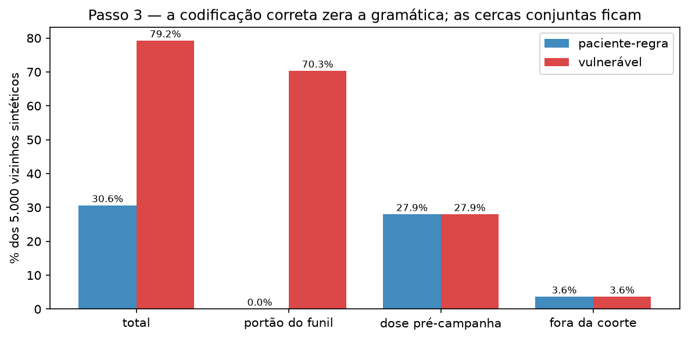

# Módulo 03 — LIME

Explicações locais por modelo substituto — Molnar, *Interpretable Machine
Learning*, cap. 14 — sobre **o modelo do curso**: o XGBoost de óbito por
COVID do módulo 00, os mesmos dois pacientes por regra dos módulos 01–02
([MODEL.md](../00-dataset/MODEL.md)). A versão Breast Cancer deste módulo
vive no histórico do git.

O ceteris paribus move uma variável de um paciente real; o LIME perturba
**todas de uma vez**, pesa os vizinhos por um kernel e ajusta um modelo
linear. Todo o módulo sai de uma pergunta: **quem são esses vizinhos?**

## Objetivos de aprendizagem

Ao fim deste módulo você deve conseguir:

1. Dizer o que o gerador de vizinhos do LIME sorteia de fato — e por que
   declarar `categorical_features` é obrigatório em dado tabular.
2. Distinguir erro de **codificação** (gramática) de impossibilidade
   **conjunta** (biologia), e contar os dois.
3. Explicar o que o R² do modelo local mede — e por que ele não é
   fidelidade ao paciente.
4. Comparar um peso LIME com um perfil ceteris paribus do jeito honesto:
   por região, nunca pelo degrau.

## O que o módulo mostra

Duas rodadas com o mesmo paciente, e três medições em cima:

1. **Rodada ingênua** (nenhuma categórica declarada): 4.999 dos 5.000
   vizinhos carregam código fabricado — a única linha válida é o próprio
   paciente. Idade sintética de −12,6 a 126,9 anos; 34,3% das linhas com
   doses negativas. O modelo responde mesmo assim, porque o wrapper de
   predição arredonda em silêncio — aqui ele tem um contador.
2. **Rodada correta** (36 discretas declaradas): zero códigos fabricados,
   pesos com nome de gente (`vacina_covid_declarada=1` −0,19,
   `idade_anos` +0,12) — e a conta que a correção **não** conserta: cada
   coluna é sorteada independente, e as cercas do módulo 00 são
   conjuntas. Pela mesma `gate_impossible` dos módulos 00–02: **30,6%**
   dos vizinhos do paciente-regra e **79,2%** dos do vulnerável são
   impossíveis (portão 0% vs 70,3%). Os números de pré-campanha e
   fora-da-coorte dão **idênticos** nos dois pacientes — a nuvem é a
   mesma; o LIME nem olhou o paciente para gerar "o bairro dele".
3. **R² ≠ fidelidade**: kernel estreito dá a explicação vazia perfeita
   (R² 0,00, erro 0,00 — todos os pesos zerados); kernel largo sobe o R²
   para 0,65 e o erro no próprio paciente sobe junto (0,045 no padrão).
   O R² mede a nuvem, não o paciente.
4. **Estabilidade**: com o gerador como única fonte de acaso (o XGBoost
   é determinístico — módulo 01), 10 sementes dão Jaccard médio 0,83 no
   top-5 e nenhuma troca de sinal no top-8.

## O que os internals estabelecem

- **O fonte, lido**: `sample_around_instance=False` por default — a
  gaussiana é centrada na **média do treino**, não no paciente (idade
  sintética média 58 anos para um paciente de 84). E o sorteio
  independente apaga a estrutura conjunta: correlação meses×doses +0,61
  no treino real, −0,00 nos vizinhos.
- **Os dois botões respeitáveis** (`sample_around_instance`,
  discretizador) salvam o paciente-regra por **geografia** (30,6% → 3,6%:
  ele mora longe da cerca do calendário) e não salvam o vulnerável em
  variante nenhuma — o portão é cerca de categóricas (70,3% nas três
  nuvens); centrar no vulnerável até **piora** (82,6%).
- **A ponte CP↔LIME**: a inclinação pontual da escadaria troca de sinal
  com o passo (idade: −0,002 com h=5, +0,003 com h=10); a comparação
  honesta é regional — peso ≈ inclinação × desvio, firme onde o peso
  está acima do ruído de semente (idade, semana).

## Aula

[`lecture/outline.md`](lecture/outline.md) — a forma viva da aula. Os
PDFs em [`lecture/`](lecture/) são o registro histórico da aula
apresentada na era BCW e não são retro-editados.

## Notebooks

- [`notebooks/lime_walkthrough.ipynb`](notebooks/lime_walkthrough.ipynb) —
  as duas rodadas e as três medições, na amostra commitada, sem rede.
- [`notebooks/lime_internals.ipynb`](notebooks/lime_internals.ipynb) — o
  fonte do gerador, os dois botões, kernel fino, 21 sementes e a ponte
  para o módulo 01.

## Referências

- Molnar, C. *Interpretable Machine Learning*, 3ª ed., cap. 14 (LIME).
- Ribeiro, M. T.; Singh, S.; Guestrin, C. (2016). *"Why Should I Trust
  You?": Explaining the Predictions of Any Classifier.* KDD 2016.
- Base, modelo, pacientes e cercas: módulo 00
  ([MODEL.md](../00-dataset/MODEL.md), [GOLD.md](../00-dataset/GOLD.md),
  [gold/MANIFEST.md](../00-dataset/gold/MANIFEST.md)).
