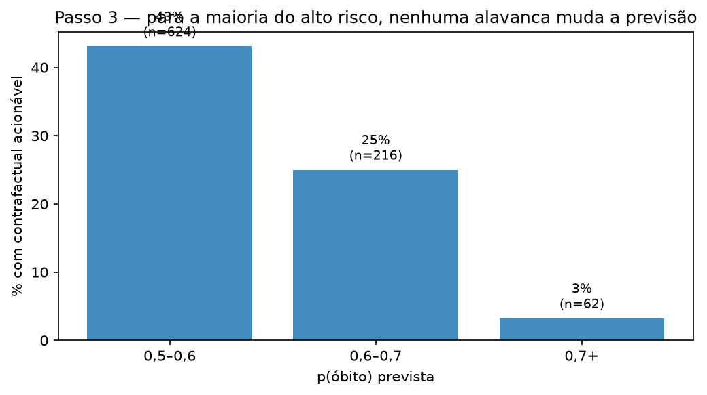

# Módulo 04 — Contrafactuais

Explicações contrafactuais — Molnar, *Interpretable Machine Learning*,
cap. 15; Wachter et al. (2018) — sobre **o modelo do curso**
([MODEL.md](../00-dataset/MODEL.md)). Módulo novo: não tem versão Breast
Cancer no histórico.

Os módulos 01–03 perguntaram *"o que pesou?"*; este inverte: **"o que
teria de mudar?"** — e a inversão muda o papel das cercas: de diagnóstico
de método doente para **restrição de busca**. E aparece uma irmã que a
`gate_impossible` não vê: a **acionabilidade**.

## Objetivos de aprendizagem

Ao fim deste módulo você deve conseguir:

1. Formular a busca contrafactual como enumeração sobre movimentos
   declarados — e dizer quando exaustão vence busca genética.
2. Distinguir três filtros que a literatura mistura: *existe?* (cerca),
   *está perto?* (Gower/Wachter), *está ao alcance?* (alavancas).
3. Explicar por que o candidato mais próximo pode ser inútil e o mais
   eficaz, absurdo.
4. Reportar honestamente o caso em que **não há** contrafactual — e por
   que essa é uma resposta do método, não uma falha dele.

## O que o módulo mostra

O paciente é escolhido por regra (p mais próximo de 0,8 no teste): 81
anos, 3 doses, imunodeprimido, pneumopata.

1. **A busca livre quer o absurdo**: a melhor mudança única é
   `idade → 10` (p 0,804 → 0,480 — "rejuvenesça 71 anos"); as seguintes
   apagam sintomas ou trocam escolaridade por `desconhecido` (o modelo
   usando qualidade de documentação — a armadilha do módulo 00, de
   novo). Só 3,5% dos candidatos caem na cerca: quem parte de um paciente
   real e muda um campo fabrica pouca ficção — o contraste com os 30,6%
   do LIME é a régua comum funcionando.
2. **"Válido" não é "acionável"**: em profundidade 2, 151 candidatos
   cruzam 0,5 passando na cerca — e os melhores pedem "seja uma criança
   sem imunodepressão" ou "esteja no 3º trimestre de gestação". Pacientes
   que *podem existir*; não são *este* paciente. (Por que "curar" uma
   comorbidade passa na cerca é medido nos internals §3: o portão do
   funil é unidirecional no dado real.)
3. **As alavancas reais, medidas no teste inteiro**: com o que uma pessoa
   de fato controla (doses antes do sintoma, para cima), o paciente do
   módulo não tem contrafactual — subir doses até **aumenta** a p dele
   (0,829, impresso). No split de teste, dos 902 pacientes com p ≥ 0,5,
   **36% têm contrafactual acionável e 64% não têm** — e no estrato
   p ≥ 0,7, só 3,2%. Um método que só sabe dizer "faça X" precisa saber
   dizer "não há X".
4. **A distância não decide**: o candidato **mais próximo** em Gower é o
   acionável que não cruza (0,0042); os absurdos ficam logo atrás
   (0,015–0,04). Proximidade, existência e alcançabilidade são três
   perguntas.

## Por que sem biblioteca

O espaço deste problema é pequeno (113 mudanças simples, 6.129 pares —
uma predição em lote), e exaustão determinística dá cobertura completa
com zero sementes; os internals (§1) confirmam que o recorte de
legibilidade do walkthrough não esconde ótimo nenhum. DiCE (Mothilal
et al., 2020) não roda no stack pinado — a versão publicada não resolve
contra numpy 2.x — e a decisão de não pinar para trás está registrada no
PR do pin (critério: o diff do lock só pode ter adições).

## Aula

[`lecture/outline.md`](lecture/outline.md).

## Notebooks

- [`notebooks/cf_walkthrough.ipynb`](notebooks/cf_walkthrough.ipynb) —
  busca livre, os três filtros e o painel do teste; amostra commitada,
  sem rede.
- [`notebooks/cf_internals.ipynb`](notebooks/cf_internals.ipynb) —
  exaustão sem recorte, invalidez por cerca, o portão unidirecional e a
  sensibilidade do limiar.

## Referências

- Molnar, C. *Interpretable Machine Learning*, 3ª ed., cap. 15
  (Counterfactual Explanations).
- Wachter, S.; Mittelstadt, B.; Russell, C. (2018). *Counterfactual
  Explanations without Opening the Black Box.* Harvard JOLT 31(2).
- Mothilal, R. K.; Sharma, A.; Tan, C. (2020). *Explaining Machine
  Learning Classifiers through Diverse Counterfactual Explanations*
  (DiCE). FAT* 2020 — citado; não executado neste stack, motivo no
  README acima.
- Base, modelo, pacientes e cercas: módulo 00.
