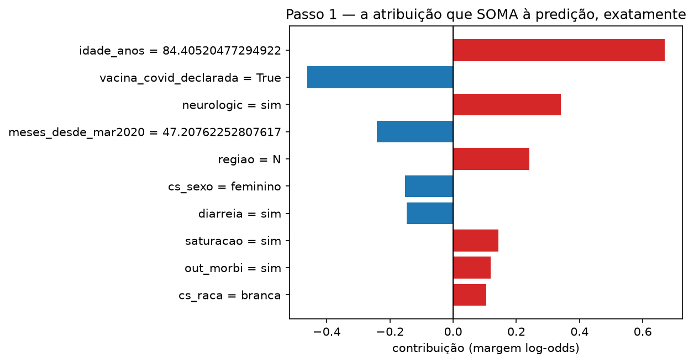

# Módulo 05 — SHAP

Valores de Shapley e SHAP — Molnar, *Interpretable Machine Learning*,
caps. 17–18; Lundberg & Lee (2017); Lundberg et al. (2020) — sobre **o
modelo do curso** ([MODEL.md](../00-dataset/MODEL.md)). Módulo novo, sem
versão Breast Cancer; fecha o arco dos cinco métodos locais.

A espinha é o **TreeSHAP exato que já mora no XGBoost**
(`pred_contribs=True`): 40 contribuições + base que somam a margem em
ponto flutuante, sem amostragem. A biblioteca `shap` não é usada — no
stack pinado a resolução exige um numba/llvmlite que não constrói aqui, e
a decisão (com o critério de falsificação) está registrada no PR do pin.

## Objetivos de aprendizagem

Ao fim deste módulo você deve conseguir:

1. Explicar o que a eficiência de Shapley garante — e em que espaço
   (margem, não probabilidade) ela vale para árvores.
2. Comparar SHAP e LIME no mesmo paciente sabendo o que pode bater
   (direção) e o que não tem por quê (escala).
3. Distinguir os condicionamentos *path-dependent* e *interventional*, e
   dizer o que cada um responde.
4. Medir o custo escondido do interventional: as coalizões são pacientes
   híbridos — e contá-los com a mesma cerca dos módulos 00–04.

## O que o módulo mostra

1. **A soma exata**: para o paciente-regra, as 40 contribuições + base
   somam +0,0000 na margem e a sigmoide dá 0,5000 — a p do modelo, dígito
   por dígito (aditividade no teste inteiro: desvio máximo 7,6×10⁻⁶). O
   compromisso que o R² do LIME não assume.
2. **SHAP × LIME, mesmo paciente**: 7/8 sinais concordam no top-8 — e a
   divergência é `meses_desde_mar2020`, exatamente a feature que o
   módulo 03 mediu como "plano no CP / ruído": os dois métodos
   discordam onde não há sinal para concordar.
3. **Global**: média|SHAP| no teste contra `gain` do treino — postos
   muito diferentes (`meses` é 3º por SHAP e 16º por gain; `regiao` 5º
   vs 18º): importância para as predições de 2024 ≠ importância para a
   construção das árvores em 2020–2022. A deriva de regime do módulo 02,
   por outro ângulo.
4. **Caminho × intervenção**: o Shapley por permutação (na mão, mesmo
   espaço de margem) concorda em direção com `pred_contribs` e diverge em
   magnitude onde as correlações moram (idade +0,67 → +0,78; vacina
   −0,46 → −0,63) — e as estimativas convergem para o interventional, não
   para o exato de caminho: são condicionais diferentes (internals §4).
5. **As coalizões são Frankensteins**: as 2.460 linhas híbridas que o
   interventional avalia são **26,3% impossíveis** pela mesma
   `gate_impossible` (portão 19,2%, dose pré-campanha 8,2%) — o curso
   fecha com a régua que abriu.

## O que os internals estabelecem

- **Determinismo herdado**: 3 refits → contribuições com desvio máximo
  0,00 (bit-idênticas); zero sementes em toda a espinha.
- **O base value** (−0,79 na margem; sigmoide 0,312) mora ao lado da taxa
  de óbito do treino (0,314) — toda explicação parte da prevalência.
- **Interações somam de volta**: a matriz 41×41 de `pred_interactions`
  reconstrói as contribuições (desvio 7,9×10⁻⁶); o par que o modelo mais
  usa em conjunto é **idade × meses** — o regime, de novo.
- **O custo do interventional**: 5 repetições por orçamento mostram o dp
  da estimativa (0,13 na maior) contra o exato de custo uma-predição.

## Aula

[`lecture/outline.md`](lecture/outline.md).

## Notebooks

- [`notebooks/shap_walkthrough.ipynb`](notebooks/shap_walkthrough.ipynb)
  — soma exata, SHAP×LIME, global, caminho×intervenção e os híbridos;
  amostra commitada, sem rede.
- [`notebooks/shap_internals.ipynb`](notebooks/shap_internals.ipynb) —
  exatidão, determinismo, base value, interações e o custo de Monte
  Carlo.

## Referências

- Molnar, C. *Interpretable Machine Learning*, 3ª ed., caps. 17–18
  (Shapley Values; SHAP).
- Lundberg, S.; Lee, S.-I. (2017). *A Unified Approach to Interpreting
  Model Predictions.* NeurIPS 2017.
- Lundberg, S. et al. (2020). *From local explanations to global
  understanding with explainable AI for trees.* Nature Machine
  Intelligence 2. (TreeSHAP — o algoritmo do `pred_contribs`.)
- Base, modelo, pacientes e cercas: módulo 00.
