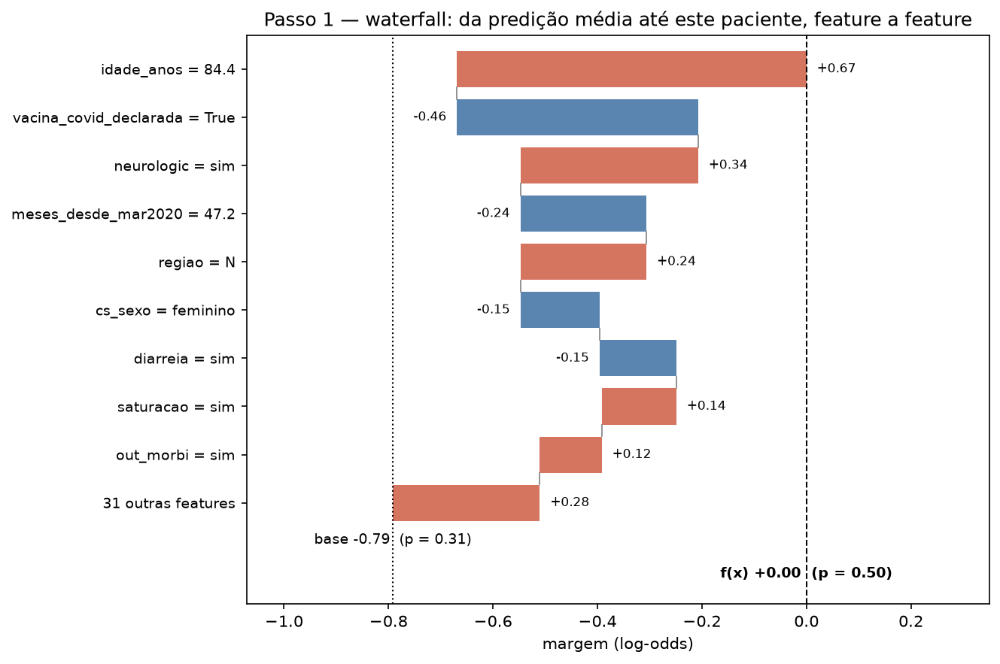

# Módulo 05 — SHAP

*Autor do módulo: [William Bendinelli](https://github.com/wbendinelli) — SCC5819 (ICMC-USP, 2026). Módulo novo, criado direto sobre o caso COVID; fecha o arco dos cinco métodos locais.*

Valores de Shapley e SHAP — Molnar, caps. 17–18; Lundberg & Lee (2017);
Lundberg et al. (2020) — sobre **o modelo do curso**
([MODEL.md](../00-dataset/MODEL.md)). A espinha é o TreeSHAP **exato**
que já mora no XGBoost (`pred_contribs`), e os **cinco gráficos clássicos
do cap. 18** — waterfall, force, beeswarm, importância global, dependence
— são reconstruídos em matplotlib puro, cada um com a leitura que o livro
prescreve e uma medição que o livro não faz.

## Objetivos de aprendizagem

Ao fim deste módulo você deve conseguir:

1. Enunciar o que um valor de Shapley é (o jogo, o ganho, a coalizão) e
   citar os quatro axiomas — com a eficiência **verificada em ponto
   flutuante** neste modelo, não assumida.
2. Ler os cinco gráficos clássicos do SHAP e apontar, em cada um, o que
   é axioma e o que é estimativa.
3. Dar a interpretação correta de um φ e desarmar as três leituras
   erradas mais comuns — contrafactual, causal, e "φ>0 ⇒ aumentar a
   feature aumenta p".
4. Distinguir os condicionamentos *path-dependent* e *interventional* e
   medir o custo escondido do segundo.

## Por que fechar o curso com SHAP

Todos os métodos anteriores entregam algo aproximado ou amostrado: o CP
é exato mas univariado; o ICE, 200 CPs; o LIME ajusta uma reta numa
nuvem sorteada; a busca contrafactual depende de um espaço declarado. O
SHAP em árvores é o único com uma garantia de **soma**: as 40
contribuições + base reproduzem a margem do paciente com desvio máximo
7,6×10⁻⁶ (verificado nas 16.142 linhas do teste), bit-idêntico entre
refits. A pergunta didática do módulo é o que essa exatidão compra — e o
que ela não compra.

## O que o módulo mostra

Os cinco gráficos clássicos, cada um com "o que olhar":

1. **Waterfall** (§1) — da predição de quem não sabe nada (base −0,79,
   sigmoide 0,31 ≈ a prevalência do treino) até f(x), feature a feature.
   Para o paciente-regra (p = 0,5000) é um cabo de guerra: idade 84
   +0,67, vacinação declarada −0,46, sintoma neurológico +0,34,
   calendário −0,24 — e a soma dá exatamente zero na margem.
2. **Force plot** (§2) — as mesmas forças deitadas numa linha,
   encontrando-se em f(x): +2,12 de empurrão contra −1,32 de freio,
   partindo da base −0,79.
3. **SHAP × LIME** (§3) — mesmo paciente do módulo 03: 7/8 sinais
   concordam; a divergência é a feature que o módulo 03 mediu como
   ruído. Dois métodos discordando onde não há sinal é o que ruído
   parece.
4. **Bar + beeswarm** (§4) — o global como média dos átomos locais.
   `meses` é 3º por média|SHAP| e **16º por gain**: importância para
   prever 2024 ≠ importância para construir árvores em 2020–2022 — a
   deriva de regime do módulo 02, vista pela atribuição.
5. **Dependence plots** (§5, amostra inteira 2020–2024) — a dispersão
   vertical é interação, e a cor diz com quem: entre 78 e 90 anos,
   φ(idade) médio +0,91 antes de mar/2022 contra +0,69 depois. E o
   painel-armadilha: φ(doses) **positivo** nos vacinados (+0,16 em 3+
   doses) — não porque "vacina mata", mas porque o crédito protetor mora
   na declaração colinear e o que sobra para a contagem é marcar os
   grupos priorizados. A leitura errada nº 3 do cap. 17, em carne viva,
   com o antídoto medido no módulo 04.
6. **Caminho × intervenção** (§6) e **os Frankensteins** (§7) — abaixo.

## O que o módulo conclui, e como isso é medido

- **A eficiência é verificável, e é o que separa SHAP de LIME.** Desvio
  máximo 7,6×10⁻⁶ no teste inteiro; sigmoide(soma) = p dígito a dígito
  no paciente; 3 refits com contribuições **bit-idênticas** (desvio
  0,0e+00 — internals §1). O dummy também foi testado e deu vácuo
  honesto: as 40 features aparecem em alguma divisão deste fit, e isso
  fica dito em vez de omitido.
- **Path-dependent × interventional são condicionais diferentes — e as
  estimativas não convergem uma para a outra.** O cap. 18 registra que o
  pacote `shap` mudou seu default para o interventional; o
  `pred_contribs` do XGBoost é o path-dependent. Medimos o interventional
  na mão (Štrumbelj & Kononenko, 2014, no mesmo espaço de margem):
  direções batem nas 8, magnitudes divergem onde as correlações moram
  (idade +0,67 → +0,78; vacina −0,46 → −0,63), e o Monte Carlo do
  internals §4 mostra as estimativas centrando em **outra resposta**
  (+0,80), não no exato de caminho (+0,67).
- **O interventional compra sua leitura avaliando o modelo em
  Frankensteins.** As 2.460 linhas híbridas do estimador são **26,3%
  impossíveis** pela mesma `gate_impossible` dos módulos 00–04 (portão
  19,2%, dose pré-campanha 8,2%) — a limitação "ignora a dependência
  entre features" do cap. 18, contada em vez de citada.
- **As interações somam de volta, e nomeiam o que o dependence plot
  colore.** `pred_interactions` reconstrói as contribuições (desvio
  7,9×10⁻⁶) e aponta idade × meses como o par mais forte do modelo — o
  mesmo que abre em duas bandas o painel de idade do §5.

## Aula

[`lecture/outline.md`](lecture/outline.md) — o que dizer, o que apontar
em cada um dos cinco gráficos, e as objeções a preparar. Módulo novo:
não há deck histórico; o outline é a única forma da aula.

## Notebooks

- [`notebooks/shap_walkthrough.ipynb`](notebooks/shap_walkthrough.ipynb)
  — a aula: o jogo e os axiomas, os cinco gráficos clássicos com "o que
  olhar", caminho × intervenção e os híbridos. Amostra commitada, sem
  rede, ~25 s.
- [`notebooks/shap_internals.ipynb`](notebooks/shap_internals.ipynb) — o
  companheiro que prova: eficiência no teste inteiro, refits
  bit-idênticos, o teste do dummy, o base value contra a definição de
  ganho do cap. 17, `pred_interactions` somando de volta, e o erro de
  Monte Carlo do estimador por permutação. ~25 s.

As figuras commitadas estão em `figures/`; rodar os notebooks as
regenera em `notebooks/figures_generated/` (git-ignorado).

## Nota de configuração

Sem a biblioteca `shap`: no stack pinado a resolução dela exige um
numba/llvmlite que não constrói aqui — decisão tomada com critério de
falsificação no PR do pin ("o diff do lock só pode ter adições"). O que
se perde são os gráficos prontos e o KernelSHAP; os gráficos este módulo
refaz, e o estimador por permutação cobre o papel didático do segundo.
As contribuições vivem na **margem** (log-odds) — o espaço em que somar
400 árvores faz sentido; as figuras anotam a sigmoide onde importa.

## Referências

- Shapley, L. S. (1953). *A Value for n-Person Games.* (O teorema da
  partilha justa que tudo aqui instancia.)
- Lundberg, S.; Lee, S.-I. (2017). [A Unified Approach to Interpreting Model Predictions](https://arxiv.org/abs/1705.07874). *NeurIPS 2017*. (SHAP: o jogo-da-predição e a unificação com LIME.)
- Lundberg, S. et al. (2020). [From local explanations to global understanding with explainable AI for trees](https://doi.org/10.1038/s42256-019-0138-9). *Nature Machine Intelligence 2*. (TreeSHAP — o algoritmo do `pred_contribs`; a fonte dos gráficos globais que o §4 reconstrói.)
- Štrumbelj, E.; Kononenko, I. (2014). *Explaining Prediction Models and Individual Predictions with Feature Contributions.* Knowledge and Information Systems 41(3). (O estimador por amostragem de permutações que o §6 implementa.)
- Molnar, C. *Interpretable Machine Learning*, 3ª ed. — caps. [17 (Shapley Values)](https://christophm.github.io/interpretable-ml-book/shapley.html) e [18 (SHAP)](https://christophm.github.io/interpretable-ml-book/shap.html). (Livro-texto: os axiomas, a interpretação correta e as leituras erradas, os gráficos, e as limitações que este módulo conta.)
- Base, modelo, pacientes e cercas: módulo 00 ([MODEL.md](../00-dataset/MODEL.md), [gold/MANIFEST.md](../00-dataset/gold/MANIFEST.md)).
